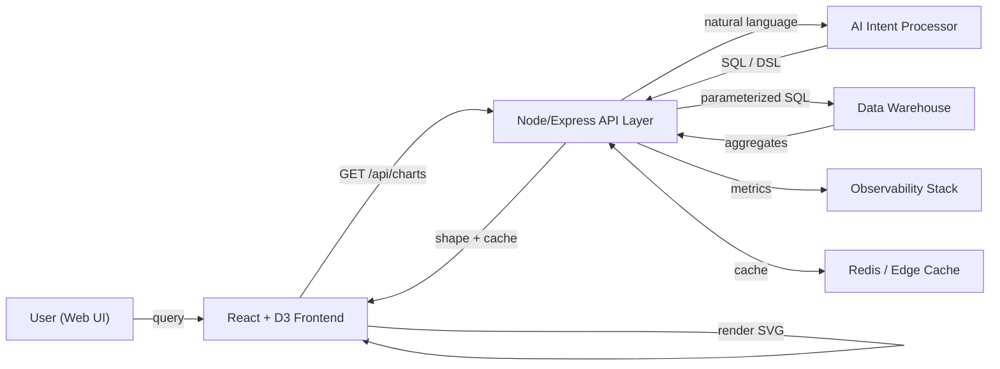

---
title: "Front-End System Design & D3 Visualization Interview Pack (Complete Edition)"
description: "Comprehensive prep guide for Senior/Staff Front-End Engineers building data-intensive web apps with React, D3, Webpack, and AI data pipelines. Single-file Markdown with inline SVGs (no external assets)."
date: 2025-10-05
---

# Front-End System Design & D3 Visualization Interview Pack (Complete Edition)

This guide is a **self-contained interview preparation document** for advanced Front-End Engineers working on **data-driven, AI-integrated visualization platforms**.  
It covers **architecture**, **React + D3 coding**, **data pipelines**, **Webpack 5 setup**, **large-data strategies**, and **interview Q&A with answers**.  
All visuals are **inline SVGs** — fully compatible with GitHub Markdown rendering. No external files needed.

---

## 0) Table of Contents

1. [High-Level Architecture](#1-high-level-architecture)  
2. [Visual Samples (Inline SVG)](#2-visual-samples-inline-svg)  
3. [Webpack 5 Setup (Aligned With JD)](#3-webpack-5-setup-aligned-with-jd)  
4. [React + D3 Integration (Commented Code)](#4-react--d3-integration-commented-code)  
5. [AI vs Non-AI Data Flow](#5-ai-vs-non-ai-data-flow)  
6. [Handling Big Data Visualization](#6-handling-big-data-visualization)  
7. [Interview Question Bank (With Answers)](#7-interview-question-bank-with-answers)  
8. [Study Roadmap](#8-study-roadmap)  

---

## 1) High-Level Architecture

### 1.1 Mermaid Overview

> If GitHub fails to render Mermaid, ensure the code fence begins with ```mermaid and there are **no extra characters** before `flowchart LR`.



### 1.2 Inline SVG — AI Data Flow (Always Renders on GitHub)

<svg viewBox="0 0 860 230" xmlns="http://www.w3.org/2000/svg" role="img" aria-label="AI data flow">
  <rect width="860" height="230" fill="#fff"/>
  <style>
    text { font-family: -apple-system,BlinkMacSystemFont,Segoe UI,Roboto,Helvetica,Arial,sans-serif; font-size: 12px; }
  </style>
  <!-- nodes -->
  <rect x="40" y="40" width="110" height="40" rx="8" fill="#8ecaff"/><text x="95" y="64" text-anchor="middle">User Query</text>
  <rect x="200" y="40" width="140" height="40" rx="8" fill="#b7e3ff"/><text x="270" y="64" text-anchor="middle">AI Intent Parser</text>
  <rect x="380" y="40" width="130" height="40" rx="8" fill="#d4f0ff"/><text x="445" y="64" text-anchor="middle">SQL Builder</text>
  <rect x="560" y="40" width="140" height="40" rx="8" fill="#e9f7ff"/><text x="620" y="64" text-anchor="middle">Data Warehouse</text>
  <rect x="380" y="130" width="140" height="40" rx="8" fill="#b7e3ff"/><text x="450" y="154" text-anchor="middle">Shape + Cache</text>
  <rect x="560" y="130" width="120" height="40" rx="8" fill="#8ecaff"/><text x="620" y="154" text-anchor="middle">D3 Charts</text>
  <!-- links -->
  <path d="M150,60C175,60 190,60 200,60" stroke="#666" stroke-width="6" fill="none" opacity="0.6"/>
  <path d="M340,60C360,60 370,60 380,60" stroke="#666" stroke-width="6" fill="none" opacity="0.6"/>
  <path d="M510,60C525,60 535,60 540,60" stroke="#666" stroke-width="6" fill="none" opacity="0.6"/>
  <path d="M610,80C610,100 450,100 450,130" stroke="#666" stroke-width="6" fill="none" opacity="0.6"/>
  <path d="M520,150C540,150 550,150 560,150" stroke="#666" stroke-width="6" fill="none" opacity="0.6"/>
</svg>

---

## 2) Visual Samples (Inline SVG)

### 2.1 Combo Chart (Bars + 3-Month Moving Average)

<svg viewBox="0 0 820 220" role="img" aria-label="Combo chart sample" xmlns="http://www.w3.org/2000/svg">
  <rect width="820" height="220" fill="#fff" />
  <!-- axes (light) -->
  <line x1="50" y1="180" x2="780" y2="180" stroke="#ddd"/>
  <line x1="50" y1="40" x2="50" y2="180" stroke="#ddd"/>
  <!-- bars -->
  <rect x="80"  y="120" width="40" height="60" fill="#6ea8fe"><title>Apr: 102.34</title></rect>
  <rect x="160" y="130" width="40" height="50" fill="#6ea8fe"><title>May: 99.87</title></rect>
  <rect x="240" y="90"  width="40" height="90" fill="#6ea8fe"><title>Jun: 120.12</title></rect>
  <rect x="320" y="95"  width="40" height="85" fill="#6ea8fe"><title>Jul: 118.77</title></rect>
  <rect x="400" y="70"  width="40" height="110" fill="#6ea8fe"><title>Aug: 130.56</title></rect>
  <rect x="480" y="72"  width="40" height="108" fill="#6ea8fe"><title>Sep: 129.99</title></rect>
  <!-- moving average line -->
  <polyline fill="none" stroke="#0d6efd" stroke-width="3"
    points="260,105 340,103 420,88 500,89" />
</svg>

### 2.2 Area (Range Brush Concept)

<svg viewBox="0 0 820 220" role="img" aria-label="Area chart sample" xmlns="http://www.w3.org/2000/svg">
  <rect width="820" height="220" fill="#fff" />
  <path d="M60,160 L120,150 L180,140 L240,130 L300,135 L360,120 L420,110 L480,120 L540,130 L600,145 L660,160 L660,180 L60,180 Z" fill="#cfe2ff" stroke="none"/>
  <polyline fill="none" stroke="#0d6efd" stroke-width="2"
    points="60,160 120,150 180,140 240,130 300,135 360,120 420,110 480,120 540,130 600,145 660,160"/>
  <!-- brush window hint -->
  <rect x="300" y="40" width="200" height="140" fill="none" stroke="#888" stroke-dasharray="4 4"/>
</svg>

### 2.3 Hexbin Density (Large Scatter)

<svg viewBox="0 0 820 220" role="img" aria-label="Hexbin density sample" xmlns="http://www.w3.org/2000/svg">
  <rect width="820" height="220" fill="#fff" />
  <!-- a handful of hexes to imply density map -->
  <polygon points="140,120 150,115 160,120 160,130 150,135 140,130" fill="#a7c7ff"/>
  <polygon points="165,105 175,100 185,105 185,115 175,120 165,115" fill="#7fb3ff"/>
  <polygon points="190,130 200,125 210,130 210,140 200,145 190,140" fill="#4d97fe"/>
  <polygon points="220,110 230,105 240,110 240,120 230,125 220,120" fill="#7fb3ff"/>
  <polygon points="250,140 260,135 270,140 270,150 260,155 250,150" fill="#a7c7ff"/>
  <polygon points="280,120 290,115 300,120 300,130 290,135 280,130" fill="#7fb3ff"/>
</svg>

### 2.4 Sankey-like Flow (Conceptual)

<svg viewBox="0 0 820 220" role="img" aria-label="AI data flow sample" xmlns="http://www.w3.org/2000/svg">
  <rect width="820" height="220" fill="#fff" />
  <!-- nodes -->
  <rect x="60" y="40" width="100" height="40" fill="#91c9ff"/><text x="110" y="65" font-size="12" text-anchor="middle">User</text>
  <rect x="220" y="40" width="120" height="40" fill="#b8e0ff"/><text x="280" y="65" font-size="12" text-anchor="middle">AI Intent</text>
  <rect x="380" y="40" width="130" height="40" fill="#d0ecff"/><text x="445" y="65" font-size="12" text-anchor="middle">Query Builder</text>
  <rect x="560" y="40" width="120" height="40" fill="#e9f6ff"/><text x="620" y="65" font-size="12" text-anchor="middle">Warehouse</text>
  <rect x="380" y="130" width="140" height="40" fill="#d0ecff"/><text x="450" y="155" font-size="12" text-anchor="middle">Shape/Cache</text>
  <rect x="560" y="130" width="120" height="40" fill="#b8e0ff"/><text x="620" y="155" font-size="12" text-anchor="middle">D3 Chart</text>
  <!-- links (simplified) -->
  <path d="M160,60 C190,60 200,60 220,60" stroke="#888" fill="none" stroke-width="8" opacity="0.6"/>
  <path d="M340,60 C360,60 370,60 380,60" stroke="#888" fill="none" stroke-width="8" opacity="0.6"/>
  <path d="M510,60 C535,60 545,60 560,60" stroke="#888" fill="none" stroke-width="8" opacity="0.6"/>
  <path d="M620,80 C620,100 450,100 450,130" stroke="#888" fill="none" stroke-width="8" opacity="0.6"/>
  <path d="M500,150 C520,150 540,150 560,150" stroke="#888" fill="none" stroke-width="8" opacity="0.6"/>
</svg>

---

## 3) Webpack 5 Setup (Aligned With JD)

This section uses **Webpack 5** (explicitly requested in the JD).  
Key goals: **fast dev builds**, **small production bundles**, **code splitting for charts**, **sane defaults**.

### 3.1 Best Practices
- **Tree-shaking**: prefer ESM packages; mark "sideEffects": false when safe.  
- **Split chart code**: lazy import D3-heavy modules (import("./charts/Hexbin")).  
- **Vendor chunk**: isolate React/D3 into cached vendor bundles.  
- **Asset modules**: inline tiny SVGs via `type: "asset/inline"`.  
- **DefinePlugin**: gate dev branches & feature flags.  
- **Bundle budgets**: keep initial JS < 200 KB gz; lazy-load heavy layouts (sankey/force).

### 3.2 Example `webpack.config.js`

```js
// webpack.config.js
const path = require('path');
const HtmlWebpackPlugin = require('html-webpack-plugin');
const { DefinePlugin } = require('webpack');

module.exports = (env, argv) => ({
  mode: argv.mode || 'production',
  entry: './src/main.tsx',
  output: {
    path: path.resolve(__dirname, 'dist'),
    filename: argv.mode === 'production' ? '[name].[contenthash].js' : '[name].js',
    clean: true,
    publicPath: '/'
  },
  resolve: {
    extensions: ['.tsx', '.ts', '.js']
  },
  module: {
    rules: [
      { test: /\.tsx?$/, use: 'ts-loader', exclude: /node_modules/ },
      { test: /\.s?css$/, use: ['style-loader', 'css-loader', 'sass-loader'] },
      { test: /\.svg$/, type: 'asset/inline' }
    ]
  },
  optimization: {
    splitChunks: { chunks: 'all' },
    runtimeChunk: 'single'
  },
  plugins: [
    new HtmlWebpackPlugin({ template: './index.html' }),
    new DefinePlugin({ __BUILD_TIME__: JSON.stringify(new Date().toISOString()) })
  ],
  devServer: {
    historyApiFallback: true,
    port: 5173,
    proxy: { '/api': 'http://localhost:3000' }
  },
  performance: {
    hints: 'warning',
    maxEntrypointSize: 512000,
    maxAssetSize: 256000
  }
});
```

> **Module Federation (optional):** if you operate multiple dashboards, federate a common D3 toolkit or UI primitives.

---

## 4) React + D3 Integration (Commented Code)

### 4.1 Combo Chart Component

```tsx
// src/components/ComboChart.tsx
// PURPOSE: Render monthly bars + a 3-month moving average line.
// INPUT:   data: Array<{ date: "YYYY-MM-DD"; sales: number }>
// OUTPUT:  Scalable SVG; tooltips via <title>; accessible <svg> with role and label.

import React, { useEffect, useMemo, useRef } from "react";
import * as d3 from "d3";

type Row = { date: string; sales: number };

export function ComboChart({ data }: { data: Row[] }) {
  const ref = useRef<SVGSVGElement | null>(null);

  // STEP 1: Prepare data (parse dates; compute moving average)
  const series = useMemo(() => {
    const parse = d3.timeParse("%Y-%m-%d");
    const pts = data.map(d => ({ date: parse(d.date)!, sales: +d.sales }));
    const arr = pts.map(d => d.sales);
    const ma = arr.map((_, i) => (i >= 2 ? d3.mean(arr.slice(i - 2, i + 1))! : null));
    return pts.map((d, i) => ({ ...d, ma: ma[i] as number | null }));
  }, [data]);

  useEffect(() => {
    if (!ref.current || series.length === 0) return;

    // STEP 2: Create SVG and base group
    const svg = d3.select(ref.current);
    const W = 820, H = 360;
    const M = { t: 20, r: 24, b: 32, l: 56 };
    svg.attr("viewBox", `0 0 ${W} ${H}`).attr("role", "img").attr("aria-label", "Monthly sales with moving average");
    svg.selectAll("*").remove();
    const g = svg.append("g").attr("transform", `translate(${M.l},${M.t})`);
    const w = W - M.l - M.r, h = H - M.t - M.b;

    // STEP 3: Scales
    const x = d3.scaleUtc()
      .domain(d3.extent(series, d => d.date) as [Date, Date])
      .range([0, w]);

    const y = d3.scaleLinear()
      .domain([0, d3.max(series, d => Math.max(d.sales, d.ma ?? 0))!]).nice()
      .range([h, 0]);

    // STEP 4: Bars (monthly sales)
    const bw = Math.max(8, (w / series.length) * 0.6);
    g.append("g").selectAll("rect").data(series).join("rect")
      .attr("x", d => x(d.date) - bw / 2)
      .attr("y", d => y(d.sales))
      .attr("width", bw)
      .attr("height", d => h - y(d.sales))
      .attr("fill", "#6ea8fe")
      .append("title")
      .text(d => `${d3.timeFormat("%b %Y")(d.date)}: ${d3.format(",")(d.sales)}`);

    // STEP 5: Line (3-month moving average)
    const line = d3.line<any>()
      .defined(d => d.ma != null)
      .x(d => x(d.date))
      .y(d => y(d.ma));

    g.append("path")
      .datum(series)
      .attr("fill", "none")
      .attr("stroke", "#0d6efd")
      .attr("stroke-width", 2)
      .attr("d", line as any);

    // STEP 6: Axes
    g.append("g").attr("transform", `translate(0,${h})`)
      .call(d3.axisBottom(x).ticks(series.length).tickFormat(d3.timeFormat("%b") as any));
    g.append("g").call(d3.axisLeft(y).ticks(5).tickFormat(d3.format("~s") as any));
  }, [series]);

  return <svg ref={ref} className="w-100" />;
}
```

### 4.2 Brush Area (Range Selection)

```tsx
// src/components/BrushArea.tsx
import React, { useEffect, useMemo, useRef } from "react";
import * as d3 from "d3";

type Row = { date: string; value: number };
export function BrushArea({ data, onRange }: { data: Row[]; onRange?: (d0: Date, d1: Date)=>void }) {
  const ref = useRef<SVGSVGElement | null>(null);

  const pts = useMemo(() => {
    const parse = d3.timeParse("%Y-%m-%d");
    return data.map(d => ({ date: parse(d.date)!, value: +d.value }));
  }, [data]);

  useEffect(() => {
    if (!ref.current || pts.length===0) return;
    const svg = d3.select(ref.current);
    const W = 860, H = 420, M = { t:20, r:24, b:80, l:56 };
    const h1 = 280, h2 = 80;
    svg.attr("viewBox", `0 0 ${W} ${H}`);
    svg.selectAll("*").remove();

    const x = d3.scaleUtc().domain(d3.extent(pts, d=>d.date) as [Date, Date]).range([M.l, W - M.r]);
    const y = d3.scaleLinear().domain([0, d3.max(pts, d=>d.value)!]).nice().range([M.t + h1, M.t]);

    const area = d3.area<any>().x(d=>x(d.date)).y0(y(0)).y1(d=>y(d.value));

    svg.append("path").datum(pts).attr("fill","#cfe2ff").attr("d", area as any);
    svg.append("g").attr("transform", `translate(0,${M.t + h1})`).call(d3.axisBottom(x));
    svg.append("g").attr("transform", `translate(${M.l},0)`).call(d3.axisLeft(y));

    // context (brush area) at bottom
    const yc = d3.scaleLinear().domain(y.domain()).range([H - M.b, H - M.b - h2]);
    const areac = d3.area<any>().x(d=>x(d.date)).y0(yc(0)).y1(d=>yc(d.value));
    svg.append("path").datum(pts).attr("fill","#e7f1ff").attr("d", areac as any);

    const brush = d3.brushX().extent([[M.l, H - M.b - h2],[W - M.r, H - M.b]])
      .on("brush end", (ev:any) => {
        if (!ev.selection) return;
        const [x0,x1] = ev.selection.map(x.invert);
        onRange?.(x0,x1);
      });

    svg.append("g").attr("class","brush").call(brush).call(brush.move, [x.range()[0]+40, x.range()[1]-40]);
  }, [pts, onRange]);

  return <svg ref={ref} className="w-100" />;
}
```

### 4.3 Hexbin Density

```tsx
// src/components/HexScatter.tsx
import React, { useEffect, useMemo, useRef } from "react";
import * as d3 from "d3";
import { hexbin as d3hexbin } from "d3-hexbin";

type P = { x: number; y: number };
export function HexScatter({ points }: { points: P[] }) {
  const ref = useRef<SVGSVGElement | null>(null);
  const data = useMemo(() => points, [points]);

  useEffect(() => {
    if (!ref.current || data.length===0) return;
    const W=820,H=360,M={t:20,r:24,b:32,l:56};
    const svg = d3.select(ref.current).attr("viewBox",`0 0 ${W} ${H}`);
    svg.selectAll("*").remove();
    const w=W-M.l-M.r,h=H-M.t-M.b;
    const g=svg.append("g").attr("transform",`translate(${M.l},${M.t})`);

    const x = d3.scaleLinear().domain(d3.extent(data,d=>d.x) as [number,number]).nice().range([0,w]);
    const y = d3.scaleLinear().domain(d3.extent(data,d=>d.y) as [number,number]).nice().range([h,0]);

    const hex = d3hexbin().x(d=>x((d as any).x)).y(d=>y((d as any).y)).radius(10).extent([[0,0],[w,h]]);
    const bins = hex(data as any);
    const c = d3.scaleSequential(d3.interpolateBlues).domain([0, d3.max(bins,b=>b.length) || 1]);

    g.append("g").selectAll("path").data(bins).join("path")
      .attr("d", hex.hexagon())
      .attr("transform", (d:any) => `translate(${d.x},${d.y})`)
      .attr("fill", (d:any) => c(d.length) as string);

    g.append("g").attr("transform",`translate(0,${h})`).call(d3.axisBottom(x));
    g.append("g").call(d3.axisLeft(y));
  }, [data]);

  return <svg ref={ref} className="w-100" />;
}
```

---

## 5) AI vs Non-AI Data Flow

| Category | AI-driven flow | Non-AI flow |
|-----------|----------------|-------------|
| Input | Natural language query | Predefined dropdown / filters |
| Transformation | Intent extraction → SQL/DSL generation | Direct API parameters |
| Validation | Requires semantic checks | Strict schema validation |
| Backend logic | Orchestrates AI + database query | Direct SQL or aggregation |
| Performance | Includes model latency | Predictable latency |
| Caching | Response-keyed, intent-aware | Query-keyed (params hash) |
| Observability | Track model version, prompt → SQL/DSL | Standard tracing |

**Guardrails for AI path:** allowlist columns/tables, parameterized SQL only, echo interpreted intent (“Showing last 6 months by region”).

---

## 6) Handling Big Data Visualization

- **Pre-aggregate** on backend (e.g., monthly buckets).  
- **Downsample** with LTTB; **LOD** via brush zoom.  
- **Density plots** (hexbin/kde) for >100k points.  
- **Canvas/WebGL** fallback when SVG nodes > 10–20k.  
- **Web Workers** for off-thread transforms.  
- **Virtualize** long lists/tables for drilldowns.

---

## 7) Interview Question Bank (With Answers)

### 7.1 React Rendering & State
**Q:** Re-render vs re-mount?  
**A:** Re-render = state/props/context change; component identity preserved; refs persist. Re-mount = unmounted then mounted (e.g., key change or conditional removal); state and refs reset.

**Q:** Why not wrap every function in `useCallback`?  
**A:** It adds memory and dependency tracking overhead. Use when passing to memoized children or as effect dependencies to keep referential stability.

**Q:** `useMemo` cost/benefit?  
**A:** Good for expensive computations or to maintain stable object identity. Avoid for trivial values; memoization itself costs CPU and memory.

**Q:** Controlled vs Uncontrolled?  
**A:** Controlled inputs mirror React state (re-render on each change). Uncontrolled store value in DOM; read via refs; fewer re-renders; good for large forms/files.

**Q:** `useRef` vs `useState`?  
**A:** `useRef` stores a mutable value that doesn’t trigger re-render; `useState` triggers render. Refs persist across renders.

**Q:** Re-render vs re-mount regarding `useState` initial value?  
**A:** Re-render does not reset `useState`; re-mount does (e.g., key change).

### 7.2 Data Fetching & Caching
**Q:** Why SWR/React Query?  
**A:** Built-in cache, de-dupe, retries, refetch-on-focus; simplifies loading/error states.

**Pattern:** *Fetch in effect with cancellation*
```tsx
useEffect(() => {
  const ctrl = new AbortController();
  fetch(url, { signal: ctrl.signal }).then(/* ... */);
  return () => ctrl.abort();
}, [url]);
```

**Pattern:** *SWR for cache + dedupe*
```tsx
import useSWR from 'swr';
const fetcher = (u: string) => fetch(u).then(r => r.json());
const { data, error, isLoading } = useSWR('/api/sales?range=6m', fetcher);
```

**With Suspense:** wrap components in <Suspense fallback={<Spinner/>}> and use suspense-enabled data libs.

### 7.3 SSR / SSG / ISR
- **SSR**: render on each request; freshest data; slower TTFB.  
- **SSG**: pre-render at build; fastest; for static content.  
- **ISR**: hybrid; revalidate in background; balance freshness and speed.

### 7.4 D3 & Visualization
**Q:** Why D3 for complex dashboards?  
**A:** Low-level control of scales/layout/axes/transforms; custom interactions (brush/zoom/linked views).

**Q:** Techniques for 1M+ points?  
**A:** Pre-aggregation; LTTB downsampling; density/hexbin; Canvas/WebGL; brushing to restrict domain; workers for heavy math.

**Q:** A11y for charts?  
**A:** <svg role="img" aria-label="">, <title>/<desc>, textual summary, keyboard navigable markers, color + pattern (not color-only).

### 7.5 APIs / BFF
**Q:** Idempotent POST for report generation?  
**A:** Use Idempotency-Key. First call computes and caches. Subsequent identical keys return same result. Async jobs respond 202 + status URL.

**Q:** Versioning strategy?  
**A:** Path (/v2/…) or media type (Accept: application/vnd.myapp.v2+json). Prefer additive changes. Announce deprecations with Sunset headers.

**Q:** Cache invalidation?  
**A:** Partition keys by tenant/params window; set sensible TTLs; invalidate on ingestion events or via explicit bust endpoints.

### 7.6 Performance & Build
**Q:** Improve LCP/INP in a viz-heavy app?  
**A:** Preload fonts, inline critical CSS, lazy-load heavy charts, reduce SVG node count, debounce interactions, use workers, prefer Canvas for dense layers.

**Q:** Webpack gotchas for tree-shaking?  
**A:** Ensure ESM; set sideEffects: false carefully; avoid dynamic require; watch for dead-code-elimination inhibitors.

### 7.7 Testing & Reliability
**Unit:** metrics transforms, binning, moving averages.  
**Component:** assert SVG shapes/paths present; axes tick counts stable.  
**E2E:** user filter → network → chart updates; brush range narrows data; CSV/PNG export works.  
**Observability:** trace FE→BFF→AI→DW; log SQL/DSL (no PII), cache hit ratio, latency SLOs.

---

## 8) Study Roadmap

1. **React Advanced:** rendering model, hooks, profiler, Suspense.  
2. **D3 Mastery:** scales, axes, layouts (sankey/force), transitions, binning/hexbin.  
3. **System Design:** BFF patterns, caching, rate-limits, observability, auth.  
4. **AI Integration:** prompt → intent → DSL → SQL; allowlists; parameterization.  
5. **Large Data:** LTTB, LOD, Canvas/WebGL, workers, memory budgeting.  
6. **Build & Perf:** Webpack 5, code splitting, budgets, Module Federation.  
7. **Testing:** Jest/RTL, MSW, Playwright; visual regression strategies.  

---

**Prepared on 2025-10-05 — Complete Interview Readiness for Senior/Staff Front-End Roles**  
_All inline visuals are SVG-based and will render natively on GitHub. No external assets required._
