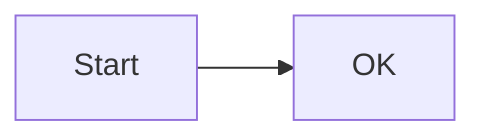
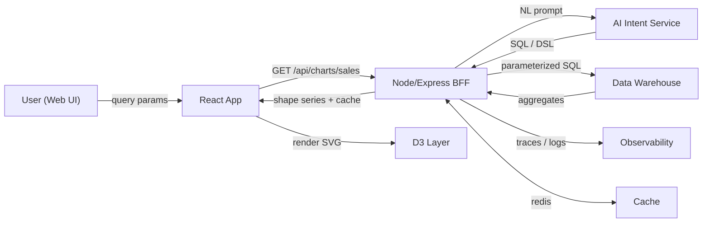

---
title: "Data Platform Front-End Interview Pack (Senior/Staff) — D3 & AI Focus"
description: "D3-first visualization system design, AI vs non-AI data handling, and end-to-end code (React + D3 + Node/Express). Includes detailed interview questions and visual samples."
date: 2025-10-05
---

# Data Platform Front-End Interview Pack (D3 & AI Focus)

This file strengthens: **(1) Mermaid diagram (GitHub-friendly)**, **(2) far more detailed interview questions/answers**, and **(3) heavily commented code and a glossary**.  
It also includes **PNG previews** of charts so you have an immediate visual impression.

---

## 0) Mermaid Sanity Check (tiny)

If GitHub can't render Mermaid, try this minimal block first to verify rendering is enabled in your repo.



If the above renders, the full diagram below should render as well.

---

## 1) Architecture Diagram (Mermaid)



**Common reasons GitHub still fails**  
- The code fence must start flush left with three backticks and the word mermaid.  
- No extra characters before `flowchart LR`.  
- Ensure your file extension is `.md` and you're viewing it in GitHub (not raw).  
- Try removing surrounding quote blocks or list indentation around the code fence.

---

## 2) AI Data vs. Non‑AI Data — What Changes?

**Non-AI request** (strict params) → BFF shapes query → DW runs parameterized SQL → return chart‑ready series.  
**AI request** (natural language) → BFF calls AI Intent Service → converts to DSL/SQL via a schema‑aware prompt → validate/allowlist → DW runs parameterized SQL → return chart‑ready series.

Key differences and safeguards:
- **Validation**: Natural language is ambiguous; enforce allowlist tables/columns; reject unknown fields.
- **Parameterization**: Never interpolate raw text into SQL; map entities to params.
- **Determinism**: Prefer deterministic DSL (domain grammar) from AI; translate DSL to SQL with server code.
- **Observability**: Log the final DSL/SQL, not the full user prompt; keep PII out of logs.
- **UX**: Echo back interpreted intent: “Showing last 6 months sales in NA for Product X”.

---

## 3) D3‑First Frontend Architecture

- **State layers**  
  - Async remote state: React Query/SWR (caching, retries, de‑dupe).  
  - Local viz state: zoom/brush window, tooltip model, selected series.  
- **Data discipline**  
  - Convert early: strings → Date, numeric → number.  
  - Keep raw vs derived data separate (e.g., moving average, bins).  
- **Performance**  
  - Pre‑aggregate in DW (groupBy month/week).  
  - Downsample (e.g., LTTB) or brush/LOD for very long series.  
  - For millions of points, switch to hexbin/density or Canvas/WebGL.  
- **Accessibility**  
  - ARIA label on <svg>, live text summary, keyboard‑focusable tooltips.

---

## 4) Visual Samples (PNG)

These PNGs are illustrative (generated in this pack) to give you an instant sense of the end result:

- Combo (bars + moving average):  
  

- Area with range selection (concept):  
  

- Hexbin (density for very large scatter):  
  

- AI data flow (schematic):  
  

You will get interactive versions via the D3 components below.

---

## 5) D3 Components (React + TypeScript)

### 5.1 Combo Chart (Monthly Bars + 3‑Month MA Line)

Purpose: show monthly totals with a smoothed trend line.  
Why D3: fine control of scales/axes and SVG primitives.

```tsx
// components/ComboChart.tsx
// PURPOSE: Render monthly bars + a 3-month moving average line.
// INPUT:   data: Array<{ date: "YYYY-MM-DD"; sales: number }>
// OUTPUT:  Scalable SVG; tooltips via <title>; accessible <svg> with role and label.

import React, { useEffect, useMemo, useRef } from "react";
import * as d3 from "d3";

type Row = { date: string; sales: number };

export function ComboChart({ data }: { data: Row[] }) {
  const ref = useRef<SVGSVGElement | null>(null);

  // STEP 1: Prepare data (parse dates; compute moving average)
  const series = useMemo(() => {
    const parse = d3.timeParse("%Y-%m-%d");
    const pts = data.map(d => ({ date: parse(d.date)!, sales: +d.sales }));
    const arr = pts.map(d => d.sales);
    const ma = arr.map((_, i) => (i >= 2 ? d3.mean(arr.slice(i - 2, i + 1))! : null));
    return pts.map((d, i) => ({ ...d, ma: ma[i] as number | null }));
  }, [data]);

  useEffect(() => {
    if (!ref.current || series.length === 0) return;

    // STEP 2: Create SVG and base group
    const svg = d3.select(ref.current);
    const W = 820, H = 360;
    const M = { t: 20, r: 24, b: 32, l: 56 };
    svg.attr("viewBox", `0 0 ${W} ${H}`).attr("role", "img").attr("aria-label", "Monthly sales with moving average");
    svg.selectAll("*").remove();
    const g = svg.append("g").attr("transform", `translate(${M.l},${M.t})`);
    const w = W - M.l - M.r, h = H - M.t - M.b;

    // STEP 3: Scales
    const x = d3.scaleUtc()
      .domain(d3.extent(series, d => d.date) as [Date, Date])
      .range([0, w]);

    const y = d3.scaleLinear()
      .domain([0, d3.max(series, d => Math.max(d.sales, d.ma ?? 0))!]).nice()
      .range([h, 0]);

    // STEP 4: Bars (monthly sales)
    const bw = Math.max(8, (w / series.length) * 0.6);
    g.append("g").selectAll("rect").data(series).join("rect")
      .attr("x", d => x(d.date) - bw / 2)
      .attr("y", d => y(d.sales))
      .attr("width", bw)
      .attr("height", d => h - y(d.sales))
      .attr("fill", "#6ea8fe")
      .append("title")
      .text(d => `${d3.timeFormat("%b %Y")(d.date)}: ${d3.format(",")(d.sales)}`);

    // STEP 5: Line (3-month moving average)
    const line = d3.line<any>()
      .defined(d => d.ma != null)
      .x(d => x(d.date))
      .y(d => y(d.ma));

    g.append("path")
      .datum(series)
      .attr("fill", "none")
      .attr("stroke", "#0d6efd")
      .attr("stroke-width", 2)
      .attr("d", line as any);

    // STEP 6: Axes
    g.append("g").attr("transform", `translate(0,${h})`)
      .call(d3.axisBottom(x).ticks(series.length).tickFormat(d3.timeFormat("%b") as any));
    g.append("g").call(d3.axisLeft(y).ticks(5).tickFormat(d3.format("~s") as any));
  }, [series]);

  return <svg ref={ref} className="w-100" />;
}
```

### 5.2 Area with Brush (Range Selection)

Purpose: pick a sub‑range in a long time series for detail.  
Key idea: brush emits [x0, x1] → convert to dates with x.invert → drive upstream query or local filtering.

```tsx
// components/BrushArea.tsx
import React, { useEffect, useMemo, useRef } from "react";
import * as d3 from "d3";

type Row = { date: string; value: number };
export function BrushArea({ data, onRange }: { data: Row[]; onRange?: (d0: Date, d1: Date)=>void }) {
  const ref = useRef<SVGSVGElement | null>(null);

  const pts = useMemo(() => {
    const parse = d3.timeParse("%Y-%m-%d");
    return data.map(d => ({ date: parse(d.date)!, value: +d.value }));
  }, [data]);

  useEffect(() => {
    if (!ref.current || pts.length===0) return;
    const svg = d3.select(ref.current);
    const W = 860, H = 420, M = { t:20, r:24, b:80, l:56 };
    const h1 = 280, h2 = 80;
    svg.attr("viewBox", `0 0 ${W} ${H}`);
    svg.selectAll("*").remove();

    const x = d3.scaleUtc().domain(d3.extent(pts, d=>d.date) as [Date, Date]).range([M.l, W - M.r]);
    const y = d3.scaleLinear().domain([0, d3.max(pts, d=>d.value)!]).nice().range([M.t + h1, M.t]);

    const area = d3.area<any>().x(d=>x(d.date)).y0(y(0)).y1(d=>y(d.value));

    svg.append("path").datum(pts).attr("fill","#cfe2ff").attr("d", area as any);
    svg.append("g").attr("transform", `translate(0,${M.t + h1})`).call(d3.axisBottom(x));
    svg.append("g").attr("transform", `translate(${M.l},0)`).call(d3.axisLeft(y));

    // context (brush area) at bottom
    const yc = d3.scaleLinear().domain(y.domain()).range([H - M.b, H - M.b - h2]);
    const areac = d3.area<any>().x(d=>x(d.date)).y0(yc(0)).y1(d=>yc(d.value));
    svg.append("path").datum(pts).attr("fill","#e7f1ff").attr("d", areac as any);

    const brush = d3.brushX().extent([[M.l, H - M.b - h2],[W - M.r, H - M.b]])
      .on("brush end", (ev:any) => {
        if (!ev.selection) return;
        const [x0,x1] = ev.selection.map(x.invert);
        onRange?.(x0,x1);
      });

    svg.append("g").attr("class","brush").call(brush).call(brush.move, [x.range()[0]+40, x.range()[1]-40]);
  }, [pts, onRange]);

  return <svg ref={ref} className="w-100" />;
}
```

### 5.3 Hexbin (Density for Huge Scatter)

Purpose: aggregate millions of points into bins to avoid overplotting.  
When: raw scatter becomes a solid blob; density reveals structure.

```tsx
// components/HexScatter.tsx
import React, { useEffect, useMemo, useRef } from "react";
import * as d3 from "d3";
import { hexbin as d3hexbin } from "d3-hexbin";

type P = { x: number; y: number };
export function HexScatter({ points }: { points: P[] }) {
  const ref = useRef<SVGSVGElement | null>(null);
  const data = useMemo(() => points, [points]);

  useEffect(() => {
    if (!ref.current || data.length===0) return;
    const W=820,H=360,M={t:20,r:24,b:32,l:56};
    const svg = d3.select(ref.current).attr("viewBox",`0 0 ${W} ${H}`);
    svg.selectAll("*").remove();
    const w=W-M.l-M.r,h=H-M.t-M.b;
    const g=svg.append("g").attr("transform",`translate(${M.l},${M.t})`);

    const x = d3.scaleLinear().domain(d3.extent(data,d=>d.x) as [number,number]).nice().range([0,w]);
    const y = d3.scaleLinear().domain(d3.extent(data,d=>d.y) as [number,number]).nice().range([h,0]);

    const hex = d3hexbin().x(d=>x((d as any).x)).y(d=>y((d as any).y)).radius(10).extent([[0,0],[w,h]]);
    const bins = hex(data as any);
    const c = d3.scaleSequential(d3.interpolateBlues).domain([0, d3.max(bins,b=>b.length) || 1]);

    g.append("g").selectAll("path").data(bins).join("path")
      .attr("d", hex.hexagon())
      .attr("transform", (d:any) => `translate(${d.x},${d.y})`)
      .attr("fill", (d:any) => c(d.length) as string);

    g.append("g").attr("transform",`translate(0,${h})`).call(d3.axisBottom(x));
    g.append("g").call(d3.axisLeft(y));
  }, [data]);

  return <svg ref={ref} className="w-100" />;
}
```

### 5.4 Sankey for AI Flow (diagrammatic)

```tsx
// components/AISankey.tsx
import React, { useEffect, useRef } from "react";
import { sankey, sankeyLinkHorizontal, sankeyLeft } from "d3-sankey";
import * as d3 from "d3";

type SankeyNode = { name: string };
type SankeyLink = { source: number; target: number; value: number };
export function AISankey() {
  const ref = useRef<SVGSVGElement | null>(null);

  useEffect(() => {
    if (!ref.current) return;
    const nodes: SankeyNode[] = [
      { name: "User Query" },
      { name: "AI Intent" },
      { name: "Query Builder" },
      { name: "Warehouse" },
      { name: "Shape/Cache" },
      { name: "D3 Chart" }
    ];
    const links: SankeyLink[] = [
      { source: 0, target: 1, value: 1 },
      { source: 1, target: 2, value: 1 },
      { source: 2, target: 3, value: 1 },
      { source: 3, target: 4, value: 1 },
      { source: 4, target: 5, value: 1 }
    ];

    const W=860,H=300,M={t:20,r:20,b:20,l:20};
    const svg = d3.select(ref.current).attr("viewBox",`0 0 ${W} ${H}`);
    svg.selectAll("*").remove();

    const { nodes: n, links: l } = sankey<SankeyNode, SankeyLink>()
      .nodeAlign(sankeyLeft)
      .nodeWidth(14).nodePadding(20)
      .extent([[M.l,M.t],[W-M.r,H-M.b]])({
        nodes: nodes.map(d=>Object.assign({},d)),
        links: links.map(d=>Object.assign({},d))
      });

    const color = d3.scaleOrdinal(d3.schemeSet2);

    svg.append("g").selectAll("rect").data(n).join("rect")
      .attr("x", d => (d as any).x0).attr("y", d => (d as any).y0)
      .attr("height", d => (d as any).y1 - (d as any).y0)
      .attr("width", d => (d as any).x1 - (d as any).x0)
      .attr("fill", (_,i)=> color(String(i)) as string);

    svg.append("g").selectAll("path").data(l).join("path")
      .attr("d", sankeyLinkHorizontal() as any)
      .attr("fill","none")
      .attr("stroke","#888")
      .attr("stroke-width", d => Math.max(1,(d as any).width))
      .attr("opacity",0.6);

    svg.append("g").selectAll("text").data(n).join("text")
      .attr("x", d => (d as any).x0 - 6).attr("y", d => ((d as any).y0 + (d as any).y1)/2)
      .attr("dy","0.35em").attr("text-anchor","end")
      .text(d => (d as any).name);
  }, []);

  return <svg ref={ref} className="w-100" />;
}
```

---

## 6) Backend: BFF with Guardrails (Express)

```ts
// server/index.ts
import express from "express";
import cors from "cors";
import * as crypto from "crypto";
import { z } from "zod";
import Redis from "ioredis";
import { aiToSql } from "./services/ai";
import { queryDw } from "./services/dw";

const app = express();
app.use(cors({ origin: true, credentials: true }));
app.use(express.json());

const redis = new Redis(process.env.REDIS_URL ?? "");

const Params = z.object({
  range: z.string().default("last_6m"),
  groupBy: z.enum(["day","week","month"]).default("month"),
  region: z.string().optional(),
  product: z.string().optional()
});

app.get("/api/charts/sales", async (req, res) => {
  try {
    const userId = req.header("x-user-id") ?? "demo";
    const params = Params.parse(req.query);
    const key = `sales:${userId}:${crypto.createHash("sha1").update(JSON.stringify(params)).digest("hex")}`;

    const cached = await redis.get(key);
    if (cached) return res.set("x-cache","HIT").json(JSON.parse(cached));

    const prompt = `Give me ${params.range} sales grouped by ${params.groupBy}`
      + (params.region ? ` in region ${params.region}` : "")
      + (params.product ? ` for product ${params.product}` : "");
    const sql = await aiToSql(prompt);

    const rows = await queryDw(sql);
    const resp = { meta: { ...params }, series: rows };

    await redis.setex(key, 60, JSON.stringify(resp));
    res.set("x-cache","MISS").json(resp);
  } catch (e:any) {
    res.status(400).json({ error: e.message ?? "Bad Request" });
  }
});

app.listen(process.env.PORT ?? 3000, () => console.log("API up"));
```

---

## 7) Interview Question Bank (Expanded)

**React Rendering & State**
- Re-render vs re-mount: triggers, diagnosing with keys and DevTools.
- useMemo/useCallback: when to use, costs, how to prove benefit with Profiler.
- Suspense for data fetching: fallback strategy, error boundaries, streaming SSR effects.

**D3 / Visualization**
- Scales and axes for time series; when to use scaleUtc vs scaleTime.
- Strategies for 1M+ points: pre-aggregation, LTTB, hexbin, Canvas/WebGL fallback.
- A11y for charts: ARIA, textual summaries, keyboard navigation patterns.

**APIs / REST / BFF**
- Idempotent POST and job orchestration (202 + status endpoint).
- Versioning choices and deprecation policy; additive evolution.
- Cache invalidation for sliding windows; partitioned keys and TTL.

**Performance (Web Vitals)**
- LCP/INP improvements in dashboards; code splitting; async import of heavy libs.
- Bundle budgets; tree-shaking pitfalls; sideEffects flag.
- Worker offload for heavy transforms; memory pressure in large SVGs.

**Testing**
- Unit vs component vs E2E boundaries; MSW for realistic network.
- Visual regression testing for charts (snapshot of SVG path/attr ranges).

**DevOps / Reliability**
- Rolling updates & zero-downtime; feature flags; canarying.
- Observability for AI flows; logging DSL/SQL not raw prompts; latency SLOs.

---

## 8) Glossary (Acronyms Expanded)

BFF: Backend For Frontend; DW: Data Warehouse; RBAC: Role‑Based Access Control;  
A11y: Accessibility; LTTB: Largest‑Triangle‑Three‑Buckets; LOD: Level of Detail;  
TTFB: Time To First Byte; SLA: Service Level Agreement.

---
