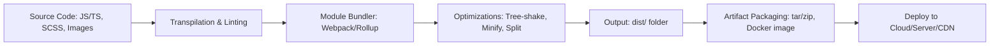

# Web Application Build & Deployment – Interview Prep Guide

This guide explains how modern web applications are compiled, bundled, and deployed to production – step by step – so you can discuss confidently in interviews.

---

## 1. Source Code to Build – Compilation & Transpilation

### a. Modern JavaScript (ES6+) & TypeScript
- **Transpilation:** Converts modern JS/TS to browser-compatible JS.
- Tools: **SWC**, **Babel**, **tsc**.
- Handles:
  - ES6+ → ES5 (for older browsers)
  - JSX → JS (React)
  - TypeScript → JavaScript (type-checking only)

```bash
tsc --noEmit # Type-check only
swc src -d dist # Fast transpilation
```

### b. Module Bundling
- Combines multiple source files into optimized bundles.
- Tools: **Webpack**, **Rollup**, **Vite**, **esbuild**.
- Benefits:
  - Tree-shaking (remove unused code)
  - Code-splitting (lazy-load chunks)
  - Asset optimization (images, fonts)

```bash
webpack --config webpack.prod.js
```

---

## 2. Bundling Process Overview



### Typical Output
- **HTML** (entry point)
- **JS bundles** (e.g., `main.[hash].js`, `vendors.[hash].js`)
- **CSS files** (compiled SCSS)
- **Static assets** (images, fonts, icons)
- **Source maps** (for debugging production code)

---

## 3. Build Optimizations

- **Minification:** Removes whitespace, renames variables (Terser).
- **Compression:** Gzip/Brotli before serving.
- **Tree-shaking:** Eliminates unused imports.
- **Code-splitting:** Load only what’s needed (lazy-load routes/components).
- **Caching:** Add content hashes to filenames (`bundle.[hash].js`).

---

## 4. Packaging & Artifacts

- **Tar/Zip Archives:** Package build outputs for CI/CD pipelines.
- **Docker Image:** Containerize the app for portability.

Example Dockerfile:
```dockerfile
FROM node:22 AS build
WORKDIR /app
COPY package.json yarn.lock ./
RUN yarn install --frozen-lockfile
COPY . .
RUN yarn build

FROM nginx:alpine
COPY --from=build /app/dist /usr/share/nginx/html
CMD ["nginx", "-g", "daemon off;"]
```

---

## 5. Deployment Targets

### a. Static Hosting
- **S3 + CloudFront** (AWS)
- **Netlify, Vercel, GitHub Pages**
- Great for SPAs and Jamstack apps.

### b. Container Deployment
- **ECS/EKS (AWS)**, **Kubernetes**, **GCP Cloud Run**
- Deploy Docker images with rolling updates.

### c. Traditional Server
- Serve via Nginx/Apache with proper caching and compression.

### d. Edge/CDN
- Use **Cloudflare Pages**, **AWS CloudFront Functions**, **Vercel Edge Functions** for global low-latency.

---

## 6. CI/CD Pipeline Stages

1. **Source Checkout** → GitHub/GitLab/Jenkins pipeline triggers.
2. **Install Dependencies** → `yarn install` or `npm ci`.
3. **Static Analysis** → ESLint, Stylelint, Prettier, Type checks.
4. **Unit & Integration Tests** → Jest, Playwright/Cypress.
5. **Build & Bundle** → Webpack/Rollup.
6. **Package Artifact** → Zip/tar or Docker build & push.
7. **Deploy** → Upload to S3, push image to ECR, or apply Helm to EKS.
8. **Post-deploy Tests** → Smoke tests, health checks, monitoring hooks.
9. **Notifications** → Slack, Teams, email.

---

## 7. Observability After Deployment
- **Monitoring:** CloudWatch, Datadog, New Relic.
- **Error Tracking:** Sentry, Rollbar.
- **Performance:** Real User Monitoring (RUM), Core Web Vitals.
- **Logging:** Centralized logs with ELK stack or Cloud provider.

---

## 8. Interview Talking Points

- Explain **build pipeline** from source → bundle → deploy.
- Describe **tree-shaking & code-splitting** benefits.
- Discuss **CI/CD** best practices (parallel builds, caching, rollback).
- Mention **Docker** for reproducible builds and easy scaling.
- Show awareness of **cloud-native deployment** options (S3/CDN vs containers).
- Emphasize **monitoring & rollback strategies** for safe releases.

---

## 9. Key Terms Cheat Sheet

| Term              | Meaning |
|------------------|--------|
| **Transpilation** | Convert modern JS/TS into browser-compatible JS |
| **Bundling** | Merge files into optimized bundles |
| **Code-splitting** | Break bundles into smaller chunks |
| **Tree-shaking** | Remove unused exports from bundles |
| **Source Maps** | Map minified code back to original for debugging |
| **Artifact** | Packaged build output ready for deployment |
| **CI/CD** | Continuous Integration/Continuous Delivery pipeline |

---

## 10. Sample CI/CD Stage (Generic Jenkins)

```groovy
pipeline {
  agent any
  stages {
    stage('Install') { steps { sh 'yarn install --frozen-lockfile' } }
    stage('Lint & Test') { steps { sh 'yarn lint && yarn test' } }
    stage('Build') { steps { sh 'yarn build' } }
    stage('Package') { steps { sh 'tar -czf app.tar.gz dist/' } }
    stage('Deploy') {
      steps {
        sh '''
          aws s3 sync dist/ s3://my-prod-bucket --delete
          aws cloudfront create-invalidation --distribution-id ABC123 --paths "/*"
        '''
      }
    }
  }
}
```

---

With this knowledge, you can confidently answer interview questions on **web build pipelines**, **bundling**, **Dockerization**, and **production deployment strategies**.
