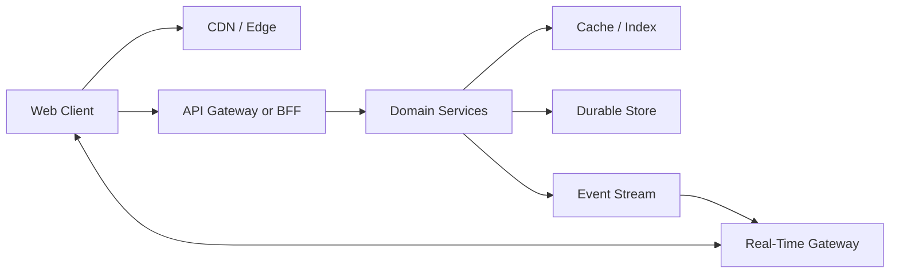
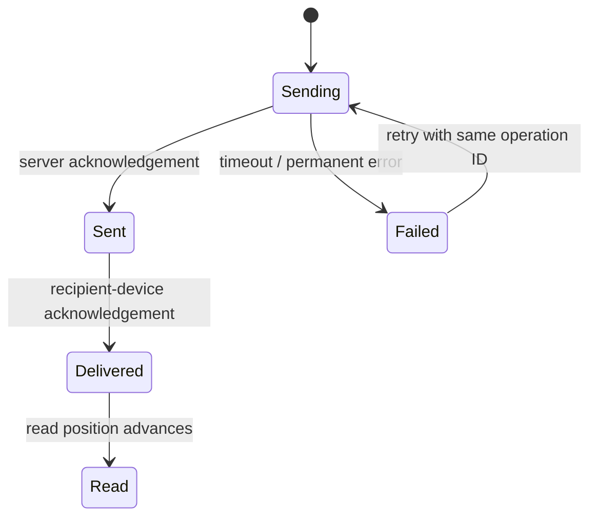
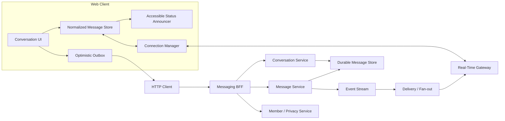
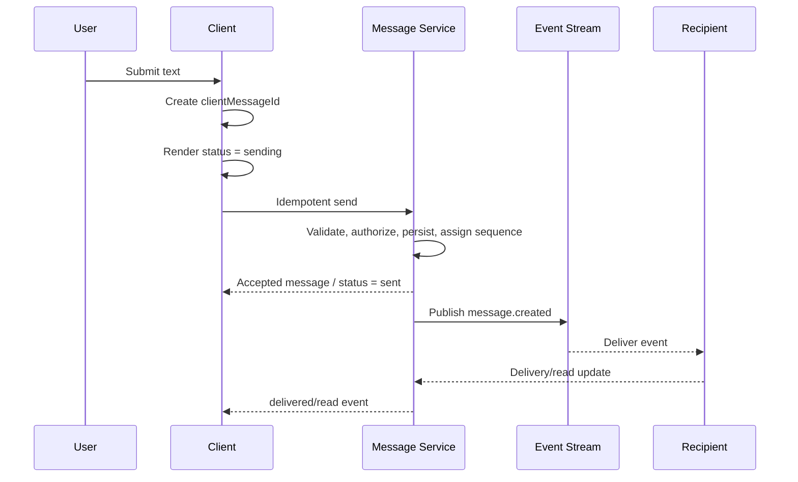
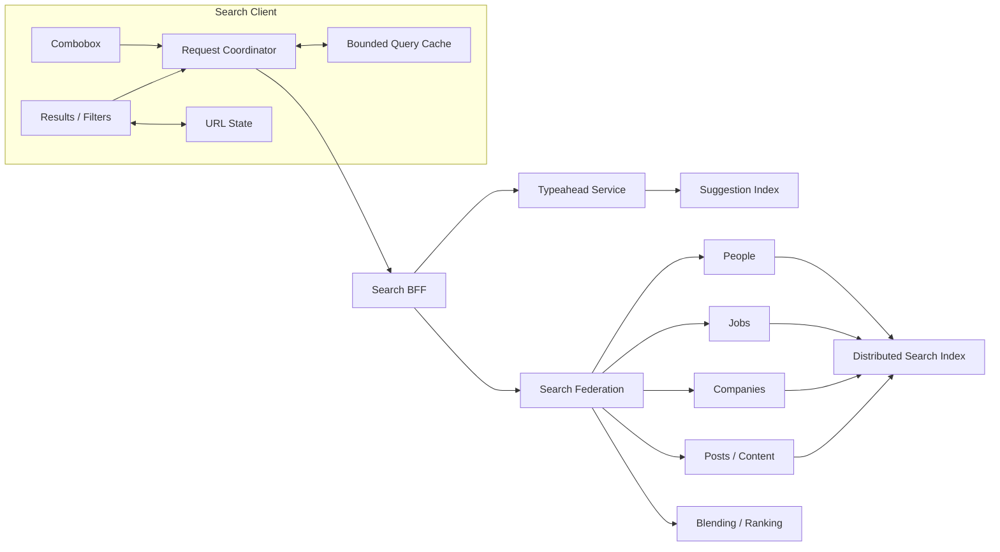
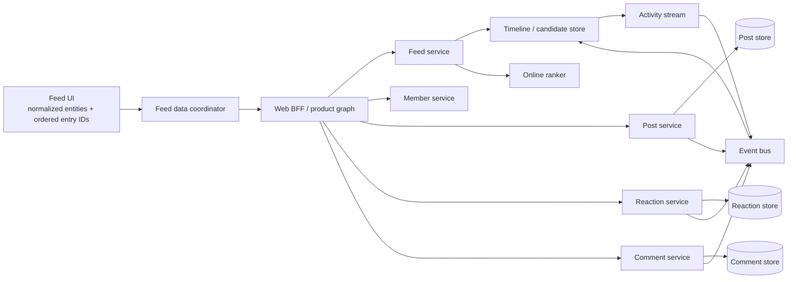
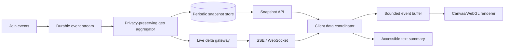
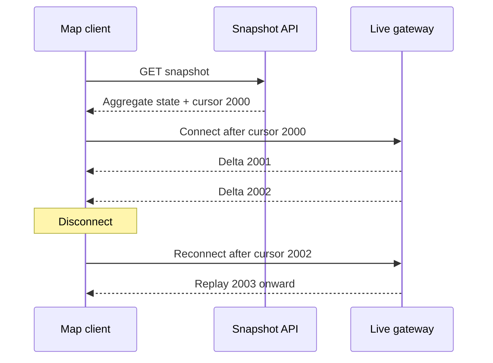
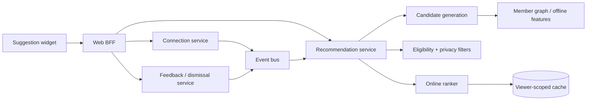

# System Design and Architecture

## Table of Contents

1. [How to Use This Guide](#how-to-use)
2. [What a Staff Frontend Design Interview Evaluates](#evaluation)
3. [The 60-Minute Design Method](#sixty-minute-method)
4. [Requirements and Scope](#requirements)
5. [Capacity and Performance Reasoning](#capacity)
6. [End-to-End Architecture](#end-to-end-architecture)
7. [Frontend State Architecture](#state-architecture)
8. [API and BFF Design](#api-design)
9. [Pagination and Collection Consistency](#pagination)
10. [Caching and Freshness](#caching)
11. [Asynchronous Request Correctness](#async-correctness)
12. [Real-Time Transport](#real-time-transport)
13. [Ordering, Deduplication, and Idempotency](#ordering)
14. [Optimistic UI and Conflict Handling](#optimistic-ui)
15. [Rendering and Runtime Performance](#runtime-performance)
16. [Accessibility as Architecture](#accessibility)
17. [Security and Privacy](#security)
18. [Reliability, Offline Behavior, and Recovery](#reliability)
19. [Observability, Testing, and Rollout](#observability)
20. [Staff-Level Ownership and Evolution](#staff-ownership)
21. [Master Trade-Off Matrix](#trade-off-matrix)
22. [Priority 1: LinkedIn Messaging Client](#messaging)
23. [Priority 2: LinkedIn Search and Autocomplete](#search)
24. [Priority 3: LinkedIn Post and Feed](#feed)
25. [Priority 4: Real-Time Join Blips on a World Map](#world-map)
26. [Priority 5: LinkedIn Suggestion Widget](#suggestions)
27. [Additional Staff Frontend Design Questions](#additional-questions)
28. [Final Interview Checklists](#checklists)
29. [References](#references)

---

<a id="how-to-use"></a>
## 1. How to Use This Guide

Study each topic in four passes:

1. **Mechanism:** Understand how the system actually works.
2. **Decision:** Know which option you would choose for the stated requirements.
3. **Trade-off:** Explain what the choice improves and what it makes harder.
4. **Communication:** Practice the interview-ready sentences aloud.

Do not memorize an architecture as a fixed answer. Memorize the reasoning that connects a requirement to a decision.

Bad:

> I use WebSocket because chat applications use WebSocket.

Better:

> The product needs bidirectional, low-latency ephemeral events such as typing and presence, so a persistent connection is appropriate. I would still use HTTP for durable, paginated history because request-response recovery is easier to reason about and operate.

---

<a id="evaluation"></a>
## 2. What a Staff Frontend Design Interview Evaluates

The interviewer is not only evaluating whether the final boxes are plausible. The stronger signals are:

### 2.1 Product decomposition

Can you convert a vague product prompt into a small set of critical user journeys?

For messaging:

```text
Open a thread
→ load recent history
→ subscribe to live updates
→ send a message
→ receive acknowledgement
→ update delivery state
```

This flow exposes the required client state, APIs, real-time protocol, and recovery behavior.

### 2.2 Technical judgment

Can you choose the simplest mechanism that meets the requirement?

- A five-item suggestion list does not need virtualization.
- A hundred-thousand-message history probably does.
- Typing indicators do not require durable database writes.
- Messages do.
- A like can usually be optimistic.
- A destructive or permission-sensitive operation may need server confirmation.

### 2.3 Depth under follow-up

The interviewer may accept your first architecture and then ask:

- What happens after reconnect?
- How do you stop an older response from replacing a newer one?
- What if the same write is retried twice?
- What if one downstream search vertical fails?
- How does a screen-reader user learn that a message was sent?
- What is your rollback plan?

A Staff answer must explain the mechanism, not just name a technology.

### 2.4 Scope control

Staff judgment includes deciding what **not** to build.

Interview-ready language:

> I see several valuable extensions, but I want to protect time for the critical path. I will keep media messages and group chat out of the initial messaging scope unless you want one of them to replace a current requirement.

### 2.5 Cross-functional and operational thinking

The design should account for:

- Product behavior and success metrics.
- Design-system and accessibility requirements.
- Backend contracts and ownership.
- Security and privacy review.
- Production monitoring and incident recovery.
- Incremental rollout and migration.
- Team boundaries and long-term maintainability.

---

<a id="sixty-minute-method"></a>
## 3. The 60-Minute Design Method

### Minutes 0–5: Clarify the prompt

Ask only questions that can change the architecture:

> Are we designing the web client only, or should I include the backend components that directly support it?

> Which user flow is the highest priority?

> Is the expected consistency strict, or can this state be temporarily stale?

> Is this public and SEO-sensitive, or authenticated and interaction-heavy?

> What scale or traffic shape should I optimize for?

Avoid spending ten minutes discovering every possible feature.

### Minutes 5–10: Write the contract

Create four boxes:

```text
P0 functional requirements
Non-functional requirements
Explicitly out of scope
Assumptions to revisit
```

Example:

```text
P0:
- one-to-one text messaging
- recent and historical messages
- sending/sent/read states
- typing and presence

NFR:
- low live-message latency
- durable history
- accessible status
- reconnect recovery

Out of scope:
- group chat
- attachments
- voice/video
```

Interview-ready language:

> I am separating product requirements from implementation choices so we do not accidentally treat a preferred technology as a requirement.

### Minutes 10–20: Draw the end-to-end architecture

Start with a small diagram:



Explain one primary request flow and one mutation or live-event flow. Do not draw twenty boxes before explaining any of them.

### Minutes 20–35: Deep-dive into the frontend

Cover:

- Component and route boundaries.
- Local, URL, and server state.
- API contracts.
- Cache and pagination.
- Loading, empty, partial, error, and offline states.
- Accessibility.
- Render performance.

### Minutes 35–48: Deep-dive into the unique hard problem

| Prompt | Unique hard problem |
|---|---|
| Messaging | ordering, reconnect, delivery states |
| Search | low latency, stale requests, federation and ranking |
| Feed | pagination, optimistic mutations, ranking freshness |
| World map | high-rate event rendering and the five-minute constraint |
| Suggestions | recommendation freshness, filtering, feedback |

### Minutes 48–55: Failure, scale, and operations

Walk through:

- Slow dependency.
- Duplicate write.
- Partial service failure.
- Disconnect and reconnect.
- Stale cache.
- Client crash or refresh.
- Rollout regression.

### Minutes 55–60: Summarize

> The design meets the critical flow through X. I chose Y because the dominant requirement is Z. The most important trade-off is A versus B. The system degrades through C, and I would validate the design with D before increasing the rollout.

---

<a id="requirements"></a>
## 4. Requirements and Scope

### 4.1 Functional requirements describe behavior

They answer: **What can the user do?**

Good:

- Load the latest 50 messages.
- Request older messages without losing scroll position.
- Select an autocomplete option with the keyboard.
- Like a post and see the authoritative count.

Weak:

- Use WebSocket.
- Use React Query.
- Use Redis.

Those are implementation choices, not functional requirements.

### 4.2 Non-functional requirements change design choices

#### Latency

Ask what latency matters:

- Search suggestions need a very low perceived response time.
- A feed refresh can tolerate more latency.
- A typing event should be fast but can be dropped.
- A message must be durable even if acknowledgement takes longer.

#### Availability

Define graceful degradation:

- Search suggestions can fail while full search still works.
- Presence can disappear while messaging remains available.
- Comments can fail while posts remain readable.

#### Consistency

Use different guarantees for different state:

| State | Appropriate guarantee | Reason |
|---|---|---|
| Message history | durable and ordered | user trust and correctness |
| Read position | monotonic, eventually synchronized | multi-device updates |
| Typing | best effort, expiring | short-lived hint |
| Presence | eventually consistent | exactness is expensive and unnecessary |
| Like count | eventually consistent with local reconciliation | high-write aggregate |

Interview-ready language:

> I would not pay the cost of strict consistency for ephemeral presence. I reserve stronger guarantees for durable user actions such as messages and connection requests.

### 4.3 Out-of-scope decisions are part of the design

State what is excluded and why:

> Media messages change upload, storage, progress, scanning, and rendering architecture. I will exclude them from the first pass so we can go deeper on delivery reliability.

### 4.4 Ambiguity must become a question, not an invention

For the underspecified suggestion widget:

> Does the widget recommend people, jobs, or content, and which actions are required?

For the post prompt:

> Are we designing one interactive post, the publishing flow, or the entire ranked feed?

---

<a id="capacity"></a>
## 5. Capacity and Performance Reasoning

Frontend design rarely needs perfect capacity math, but it needs traffic-shape reasoning.

### 5.1 Identify the dominant dimension

- Messaging: concurrent connections and live event rate.
- Search: read QPS and latency distribution.
- Feed: read amplification, ranking cost, media bytes.
- World map: events per second and render rate.
- Suggestions: recommendation computation and cache freshness.

### 5.2 Estimate only when it affects a decision

Suppose a map receives 20,000 join events per second but the browser can display only 60 frames per second. The implication is not merely “scale the server.” The client must:

- Buffer events.
- Aggregate or sample visual blips.
- Batch work per animation frame.
- Preserve accurate aggregate counts even when individual animations are dropped.

### 5.3 Use percentiles

Average latency hides slow users.

Prefer:

```text
p50: typical experience
p95: common worst experience
p99: tail and dependency problems
```

Interview-ready language:

> I would set a p95 user-visible latency target rather than optimizing the average, because slow suggestions or message acknowledgements dominate perceived reliability.

### 5.4 Frontend budgets

Tie budgets to experience:

- Time to first useful content.
- Time from keystroke to suggestions.
- Interaction to next paint.
- Long-task frequency.
- Maximum retained DOM nodes.
- Memory growth during a long session.
- Bytes loaded before the critical UI is usable.

Do not optimize before measurement:

> I would first instrument the critical interaction, segment by device and network class, and then optimize the dominant phase: network, parsing, JavaScript, layout, or paint.

---

<a id="end-to-end-architecture"></a>
## 6. End-to-End Architecture

### 6.1 Browser

Responsibilities:

- Render and interaction.
- Local presentation state.
- Server-data cache.
- Request cancellation and deduplication.
- Optimistic state.
- Accessibility behavior.
- Telemetry.

It should not own:

- Authorization decisions.
- Global ranking truth.
- Durable delivery truth.
- Sensitive recommendation filtering.

### 6.2 CDN and edge

Use for:

- Versioned JavaScript and CSS.
- Public images and media.
- Public cacheable documents.
- Edge request termination or routing.

Do not cache personalized responses publicly. Use appropriate `Cache-Control`, `Vary`, and authorization-aware policies.

### 6.3 API gateway

Useful for:

- Authentication enforcement.
- Routing.
- Rate limiting.
- Request IDs.
- Protocol normalization.

It should not become a large product-logic monolith.

### 6.4 Backend-for-frontend

A BFF aggregates data in the shape required by one client surface.

Why choose it:

- One screen otherwise calls many services.
- Client would need domain-specific fan-out logic.
- Partial failures need consistent handling.
- Payload can be tailored for web.

Costs:

- Another owned service.
- Risk of duplicating domain logic.
- Coupling to one client.
- Potential bottleneck.

LinkedIn has described frontend complexity caused by multiple microservice calls, duplicate downstream work, and partial failures, as well as its BFF-oriented GraphQL architecture. See [LinkedIn Engineering: GraphQL for Product Development](https://www.linkedin.com/blog/engineering/architecture/how-linkedin-adopted-a-graphql-architecture-for-product-developm).

Interview-ready language:

> I would keep authorization and domain invariants in domain services. The BFF owns orchestration and response shaping, not the source of truth.

### 6.5 Domain services

Examples:

- Messaging service.
- Search federation.
- Feed service.
- Reaction service.
- Recommendation service.

Each should own a coherent domain and its invariants.

### 6.6 Event stream

An event stream decouples durable state changes from asynchronous consumers:

```text
Post created
→ durable write succeeds
→ event published
→ feed index, notifications, analytics, and moderation consume
```

Benefits:

- Independent consumers.
- Replay.
- Absorbs traffic spikes.

Costs:

- Eventual consistency.
- Duplicate delivery.
- Schema evolution.
- Ordering limitations.
- Operational complexity.

The client should not assume exactly-once delivery merely because the backend uses a stream.

---

<a id="state-architecture"></a>
## 7. Frontend State Architecture

### 7.1 Classify before choosing a store

#### Local presentation state

- Popup open.
- Active option.
- Composer height.
- Hover state.

Keep local because sharing it increases coupling without benefit.

#### URL state

- Search query.
- Search vertical.
- Filters.
- Selected tab.

Put navigable and shareable state in the URL.

#### Server state

- Messages.
- Posts.
- Search results.
- Suggestions.
- Presence.

Needs cache, deduplication, freshness, and mutation reconciliation.

#### Durable client-only state

- Draft message.
- Offline outbox.
- User preference.

May use IndexedDB or an appropriate persistent store. Do not place sensitive data in persistent storage without a security and privacy decision.

### 7.2 Normalize shared entities

Instead of:

```text
feedPage1[0] = full post
profileActivity[4] = another copy of same post
```

Use:

```text
postsById[postId]
feedPages = [[postId, ...]]
profileActivity = [postId, ...]
```

Benefits:

- One reaction update changes every view.
- Less duplicated memory.
- Entity-level versions are easier.

Costs:

- More selectors and indirection.
- Ordered page metadata remains separate.
- Over-normalizing tiny isolated data adds complexity.

### 7.3 Derived state

Do not store values that can be safely computed:

```text
isEmpty = results.length === 0
```

Store derived state only if computation is expensive and memoization is justified.

### 7.4 State machines prevent invalid combinations

Message:



Benefits:

- Valid transitions are explicit.
- Testing is systematic.
- Older events cannot silently regress state.

Costs:

- More modeling work.
- Overkill for a binary toggle.

Interview-ready language:

> The complexity is in the lifecycle, not the component tree, so I would make the state transition model explicit and test every transition.

---

<a id="api-design"></a>
## 8. API and BFF Design

### 8.1 Start from user flows

Every endpoint should support a concrete flow.

Bad:

```http
GET /everything-for-page
```

Better:

```http
GET /conversations?cursor=...
GET /conversations/{id}/messages?before=...
PUT /conversations/{id}/read-position
```

### 8.2 REST

Choose REST when:

- Resources and mutations are stable.
- HTTP semantics are useful.
- Cache behavior is important.
- One endpoint maps cleanly to one domain.

Benefits:

- Simple operational model.
- Clear ownership.
- Conditional requests and caching.
- Easier per-endpoint metrics.

Costs:

- Complex pages may require waterfalls or fan-out.
- Client may over-fetch or under-fetch.
- Version coordination across many endpoints.

### 8.3 GraphQL or typed BFF

Choose when:

- One page composes many domains.
- Mobile and web need different shapes.
- Partial data is useful.
- Schema tooling improves many teams.

Benefits:

- Client specifies required fields.
- Typed schema.
- Fewer client round trips.
- Good for aggregation.

Costs:

- Query-cost control.
- Field-level authorization.
- More complex caching.
- N+1 and duplicated resolver calls.
- Partial-error semantics.
- Schema governance.

Interview-ready language:

> I would choose the API style based on aggregation needs, not fashion. Search federation and feed composition benefit from a BFF; a single idempotent reaction mutation remains straightforward as REST.

### 8.4 Mutation contract

A production mutation should answer:

- Was it accepted?
- What is the authoritative entity state?
- What version is it?
- Is retry safe?
- Was the request a duplicate?

Example:

```json
{
  "operationId": "op-123",
  "post": {
    "id": "p1",
    "viewerReaction": "LIKE",
    "likeCount": 203,
    "version": 18
  }
}
```

### 8.5 Errors

Separate:

- Validation error.
- Permission error.
- Rate limit.
- Conflict/version mismatch.
- Temporary dependency failure.
- Unknown server failure.

The client should not retry all failures.

```text
400 validation → show field error
401 authentication → refresh or sign in
403 authorization → remove forbidden action
409 conflict → re-fetch/reconcile
429 rate limit → respect Retry-After
5xx → bounded backoff if safe
```

### 8.6 Versioning

Prefer backward-compatible evolution:

- Add optional fields.
- Keep old enum values understood.
- Version real-time event envelopes.
- Use capability negotiation for major behavior changes.

Do not deploy a client that requires a new response before the server rollout is complete.

---

<a id="pagination"></a>
## 9. Pagination and Collection Consistency

### 9.1 Offset

```http
GET /items?offset=40&limit=20
```

Choose when:

- Data is relatively static.
- Random page navigation matters.
- Stable snapshot semantics exist.

Problems in changing collections:

1. Client reads offset 0–19.
2. New items are inserted at the beginning.
3. Client reads offset 20–39.
4. Some old items repeat; some are skipped.

### 9.2 Cursor

```http
GET /feed?after=opaque-token&limit=20
```

The cursor may encode:

- Sort key.
- Entity ID tie-breaker.
- Ranking snapshot/version.
- Viewer context.

Keep it opaque so the server can change encoding.

Choose for:

- Feed.
- Messages.
- Comments.
- Recommendations.
- Continuously changing search results.

Costs:

- Cannot naturally jump to arbitrary page N.
- Cursors may expire.
- A personalized cursor must not be reused across viewers.

### 9.3 Merge rules

When adding a page:

- Deduplicate by stable entity ID.
- Preserve server ordering.
- Do not sort by client clock.
- Store page cursor separately from entities.
- Decide how refreshed items update existing entities.

### 9.4 Scroll anchoring

For upward-loaded chat history:

```text
Capture anchor message and its offset
→ prepend older messages
→ restore anchor offset
```

For a refreshed feed:

- Do not silently push the current reading position.
- Show “New posts available.”
- Apply refresh when the user chooses.

---

<a id="caching"></a>
## 10. Caching and Freshness

### 10.1 A cache is a correctness policy, not just a Map

You must define:

- Key.
- Value.
- Freshness duration.
- Maximum size.
- Eviction.
- Invalidation.
- Sharing boundary.
- Behavior when stale.

### 10.2 Cache layers

| Layer | Good use | Main risk |
|---|---|---|
| Memory | suggestions, open conversations | lost on reload; unbounded growth |
| IndexedDB | drafts, offline outbox | migration, privacy, transaction complexity |
| HTTP cache | versioned assets, safe GETs | accidental personalized-data sharing |
| Service worker | offline shell, controlled resource cache | stale app logic and update complexity |
| CDN | public immutable assets/media | authorization and invalidation mistakes |
| Server cache | hot search/recommendation data | stampede and stale results |

### 10.3 Freshness models

#### TTL

Simple:

```text
fresh until time T
```

Good for short-lived suggestion caches.

Weakness:

- Data can change immediately after caching.
- All entries may expire together and cause a stampede.

#### Stale-while-revalidate

```text
Return cached value immediately
→ fetch in background
→ update future consumers
```

Good for:

- Feed preview.
- Recommendation widget.
- Search suggestion cache where slight staleness is acceptable.

Bad for:

- Permission-sensitive data after access is revoked.
- Message delivery truth.

#### Validation

HTTP `ETag` and `If-None-Match` allow revalidation without retransmitting an unchanged body. See [MDN HTTP Caching](https://developer.mozilla.org/en-US/docs/Web/HTTP/Guides/Caching).

### 10.4 Cache keys

Autocomplete key:

```text
normalized query
+ search vertical
+ locale
+ viewer/permission context
+ experiment version
```

Recommendation key:

```text
viewer
+ surface
+ ranking version
+ page cursor
```

Missing context can leak or mix personalized data.

### 10.5 Invalidation

Options:

- Short TTL.
- Mutation-driven update.
- Version tag.
- Server event invalidation.
- Revalidation on focus.
- Explicit cache clear on identity/permission change.

Interview-ready language:

> I prefer bounded staleness over pretending that cache invalidation can be perfect. I will define which data may be stale, for how long, and which mutations must update or invalidate it immediately.

---

<a id="async-correctness"></a>
## 11. Asynchronous Request Correctness

### 11.1 The stale-response race

```text
Request A: "soft" starts
Request B: "software" starts
Request B finishes first and renders
Request A finishes later and incorrectly overwrites B
```

### 11.2 Debounce

Debounce waits until input has paused.

Benefits:

- Reduces request volume.
- Avoids searching incomplete query fragments.

Costs:

- Adds deliberate latency.
- A large delay makes the UI feel unresponsive.
- Does not cancel a request already in flight.

### 11.3 AbortController

Abort stops a supported fetch/stream operation and saves work. See [MDN AbortController](https://developer.mozilla.org/en-US/docs/Web/API/AbortController/abort).

It is not a complete correctness guarantee because:

- The response may have completed just before abort.
- A wrapper may not propagate the signal.
- Cache or non-fetch async work may still resolve.

### 11.4 Request version

```js
let latestRequest = 0;

async function search(query) {
    const request = ++latestRequest;
    const data = await fetchResults(query);

    if (request !== latestRequest) {
        return;
    }

    render(data);
}
```

The version prevents stale rendering even if cancellation fails.

Interview-ready language:

> Cancellation is a resource optimization; the request version is the final correctness check.

### 11.5 Request deduplication

If multiple components request the same key:

- Share one in-flight Promise.
- Notify all consumers.
- Abort only when no consumer remains.

This prevents duplicated network work but adds reference-count or subscriber management.

---

<a id="real-time-transport"></a>
## 12. Real-Time Transport

### 12.1 Polling

Mechanism:

```text
Client sends GET every N seconds.
```

Benefits:

- Uses ordinary HTTP.
- Easy authentication, retry, and observability.
- Works through common infrastructure.

Costs:

- Delay up to polling interval.
- Empty requests.
- Synchronized clients can create load spikes.

Implementation details:

- Add jitter.
- Pause or reduce polling in hidden tabs.
- Use ETag/cursor to avoid full retransmission.
- Back off after errors.
- Prevent overlapping polls.

Choose for:

- Low-frequency updates.
- A fallback.
- Systems where seconds or minutes of delay are acceptable.

### 12.2 Long polling

Mechanism:

- Server holds request until event or timeout.
- Client immediately reconnects after response.

Benefits:

- Lower latency than polling.
- HTTP-compatible.

Costs:

- Repeated request setup.
- Many held requests.
- More awkward than a persistent stream for high-frequency events.

### 12.3 Server-Sent Events

Mechanism:

- One long-lived HTTP response sends text events server → client.
- Browser `EventSource` handles the stream and reconnection behavior.

Benefits:

- Simple one-way push.
- Natural for notifications and dashboards.
- Uses HTTP semantics.

Costs:

- Client messages still need HTTP.
- Connection limits matter, especially without HTTP/2.
- Less suitable for rich bidirectional chat protocol.

MDN documents SSE as a one-way connection and notes transport-specific connection limits. See [Using Server-Sent Events](https://developer.mozilla.org/en-US/docs/Web/API/Server-sent_events/Using_server-sent_events).

### 12.4 WebSocket

Mechanism:

- One persistent, full-duplex session.
- Application defines message envelopes, acknowledgement, heartbeat, and recovery.

Benefits:

- Low-latency bidirectional events.
- Good for chat, typing, presence, collaboration.

Costs:

- Connection fleet and load balancing.
- Reconnect and token renewal.
- Application-level reliability.
- Backpressure: the widely supported `WebSocket` API does not automatically slow the source when the application cannot process events fast enough. See [MDN WebSocket API](https://developer.mozilla.org/en-US/docs/Web/API/WebSockets_API).

### 12.5 Transport selection

| Need | Preferred starting point |
|---|---|
| Search/autocomplete | HTTP |
| Feed page loading | HTTP |
| Occasional feed refresh hint | polling or SSE |
| Notifications | SSE or WebSocket if shared platform |
| Chat messages/typing/presence | WebSocket |
| World-map live events | SSE for one-way; WebSocket if shared/live controls |

Interview-ready language:

> The transport does not provide product-level reliability. Whichever transport I choose, I still need event IDs, recovery cursors, deduplication, and backpressure behavior.

---

<a id="ordering"></a>
## 13. Ordering, Deduplication, and Idempotency

### 13.1 Why network arrival order is insufficient

Events can:

- Be retried.
- Pass through different partitions.
- Arrive after reconnect.
- Be delivered twice.
- Be delayed on one device.

### 13.2 Event envelope

```json
{
  "eventId": "evt-123",
  "streamId": "conversation-9",
  "sequence": 811,
  "type": "message.created",
  "version": 2,
  "serverTimestamp": "2026-07-27T20:00:00Z",
  "payload": {}
}
```

### 13.3 Sequence handling

For expected sequence `811`:

- Receive `811`: apply and expect `812`.
- Receive `810`: duplicate/old; ignore if already applied.
- Receive `814`: gap; buffer and request `812–813`.

Global ordering is usually too expensive and unnecessary. Prefer ordering within the smallest meaningful stream, such as a conversation.

### 13.4 Idempotent writes

Client generates a stable operation ID before the first attempt:

```text
POST fails ambiguously
→ retry with same operation ID
→ server returns original result instead of creating a duplicate
```

Suitable for:

- Message send.
- Comment creation.
- Connection request.
- Post creation.

For setting state, `PUT` is often naturally clearer:

```http
PUT /posts/{id}/viewer-reaction
```

### 13.5 Exactly once

Avoid promising exactly-once delivery across a distributed system. A practical design is:

```text
At-least-once transport
+ idempotent processing
+ deduplication
= exactly-once user-visible effect
```

---

<a id="optimistic-ui"></a>
## 14. Optimistic UI and Conflict Handling

### 14.1 Decision test

Use optimistic UI when:

- Success probability is high.
- Action is reversible.
- Rollback can be explained.
- Immediate feedback is valuable.

Avoid or limit it when:

- Server permission is uncertain.
- Operation is destructive or financially sensitive.
- Rollback would confuse or lose user work.

### 14.2 Optimistic transaction

```text
Capture previous state
→ apply local patch
→ send idempotent mutation
→ reconcile authoritative response
→ rollback or mark failed
```

### 14.3 Why rollback alone is insufficient

Concurrent server changes may make the captured previous count stale.

Example:

```text
Local count: 12
Other users add 5 likes
Our optimistic like fails
Rollback to 12 would erase visible knowledge of those 5 likes
```

Better:

- Re-fetch authoritative entity.
- Use entity version.
- Roll back the viewer’s reaction state, then reconcile count.

### 14.4 Conflict resolution

Options:

- Last-write-wins: simple, may lose changes.
- Version precondition: reject stale update with `409`.
- Field-level merge: useful for independent fields.
- Operational transformation/CRDT: only for true collaborative editing; too complex for ordinary forms.

Interview-ready language:

> I would not introduce CRDTs unless concurrent editing is a core requirement. A versioned mutation and explicit conflict UI are simpler for profile or post editing.

---

<a id="runtime-performance"></a>
## 15. Rendering and Runtime Performance

### 15.1 Diagnose the pipeline

```text
Network
→ parse/compile JavaScript
→ execute
→ style calculation
→ layout
→ paint
→ composite
```

A system-design answer should identify the likely bottleneck instead of saying “memoize everything.”

### 15.2 Virtualization

Mechanism:

- Render only visible items plus overscan.
- Represent removed space with spacers.
- Recycle/update item DOM.

Benefits:

- Bounded DOM size.
- Lower layout and memory cost.

Costs:

- Dynamic-height measurement.
- Focus and screen-reader complexity.
- Browser find-in-page may not see unrendered content.
- Scroll anchoring becomes harder.

Use for:

- Long message history.
- Long feed.
- Large result list.

Do not use for ten autocomplete suggestions.

### 15.3 Layout stability

Reserve image/media dimensions and skeleton space so asynchronous content does not move controls under the user. Current Core Web Vitals cover loading, responsiveness, and visual stability through LCP, INP, and CLS. See [web.dev Web Vitals](https://web.dev/articles/vitals).

### 15.4 Main-thread scheduling

- Keep input handlers small.
- Batch DOM reads, then writes.
- Yield during long list processing.
- Use `requestAnimationFrame` for visual updates.
- Use Web Workers for CPU-heavy parsing/ranking only when transfer and complexity costs are justified.

### 15.5 Code delivery

- Route-level code splitting.
- Lazy-load media-heavy features.
- Preload only critical assets.
- Hash immutable bundles.
- Avoid shipping the entire messaging/feed application for a small embedded widget.

### 15.6 Measure in the field

Track:

- Real user device/network classes.
- Long tasks.
- Memory over session duration.
- Interaction-specific latency.
- Error and abandonment correlations.

Interview-ready language:

> I will optimize the critical user interaction rather than only the initial page load. For search, the primary metric is keystroke-to-suggestion latency; for messaging, it is send-to-ack and receive-to-render latency.

---

<a id="accessibility"></a>
## 16. Accessibility as Architecture

### 16.1 Semantics before ARIA

Use:

- `button` for actions.
- `a` for navigation.
- `form`, `label`, `input`, `textarea`.
- `article` for posts.
- Meaningful headings and landmarks.

ARIA supplements missing semantics; it does not repair incorrect interaction logic.

### 16.2 Keyboard model

Define:

- What receives DOM focus?
- Which keys operate the component?
- Where focus moves after insertion/removal?
- How Escape behaves?
- Whether focus order matches visual order?

### 16.3 Dynamic announcements

Use `aria-live="polite"` for useful, non-urgent updates:

- “Message sent.”
- “Five results available.”
- “Comment added.”

Avoid announcing:

- Every typing event.
- Every map blip.
- Every internal retry.

Provide aggregate summaries instead.

### 16.4 Infinite/dynamic content

Dynamic feeds can disrupt assistive-technology navigation. W3C’s feed pattern describes the relationship among the feed container, articles, focus, loading, and `aria-busy`. See [W3C Feed Pattern](https://www.w3.org/WAI/ARIA/apg/patterns/feed/).

### 16.5 Reduced motion and visual alternatives

- Respect `prefers-reduced-motion`.
- Do not encode state only by color.
- Preserve readable contrast.
- Support zoom and text resize.
- Provide textual summary for Canvas/WebGL visualizations.

Interview-ready language:

> Accessibility changes state and focus architecture, so I include it before implementation. It is not a post-launch attribute pass.

---

<a id="security"></a>
## 17. Security and Privacy

### 17.1 Authentication versus authorization

- Authentication: who is the user?
- Authorization: may this user perform this action on this resource?

The UI can hide unavailable actions, but the server must enforce authorization.

### 17.2 XSS

User-generated message, post, comment, profile, and suggestion text must be rendered as text unless sanitized through a reviewed rich-content pipeline.

Avoid:

```js
element.innerHTML = userContent;
```

### 17.3 CSRF

For cookie-authenticated mutations:

- SameSite cookies.
- CSRF token where needed.
- Origin checks.
- Avoid state change through GET.

### 17.4 Content Security Policy

CSP reduces damage from injected scripts, but it is defense in depth, not a substitute for safe rendering.

### 17.5 Privacy boundaries

- Presence settings must be enforced server-side.
- Search caches must include viewer/permission context.
- Private feed data must not enter shared caches.
- Map data should be coarse and aggregated.
- Logs should avoid raw message text and sensitive queries.

### 17.6 Abuse

Account for:

- Rate limiting.
- Spam and automated requests.
- Block/mute.
- Malicious links.
- Content moderation.
- Connection-request abuse.

Interview-ready language:

> I will distinguish product visibility from authorization. Removing a button is a UX decision; preventing the operation is a server-side security invariant.

---

<a id="reliability"></a>
## 18. Reliability, Offline Behavior, and Recovery

### 18.1 Model every visible state

```text
initial
loading
success
empty
partial
stale
retryable error
permanent error
offline
reconnecting
```

### 18.2 Retry policy

Retry only if:

- Failure is transient.
- Operation is safe or idempotent.
- Retry budget remains.

Use:

- Exponential backoff.
- Jitter.
- Maximum attempts/time.
- `Retry-After` for rate limits.

### 18.3 Circuit breaking at the client

The browser should not aggressively call a known-failing optional service.

Simpler frontend version:

- Suspend an optional request after repeated failures.
- Show degraded UI.
- Retry on user action or after cooldown.

Avoid building a complex distributed circuit breaker in every component.

### 18.4 Offline

Levels:

1. Read cached data.
2. Preserve drafts.
3. Queue idempotent writes.
4. Full offline product.

Each level adds complexity.

For queued writes:

- Durable operation ID.
- Ordered outbox.
- User-visible pending state.
- Retry on connectivity.
- Conflict handling.
- Expiration/cancellation.

### 18.5 Partial failure

If a search vertical fails:

- Return successful verticals.
- Mark failed section.
- Allow targeted retry.

If presence fails:

- Hide presence or show unknown.
- Keep messaging functional.

Interview-ready language:

> I separate critical-path dependencies from optional enrichment. Optional failures should reduce richness, not take down the primary user journey.

---

<a id="observability"></a>
## 19. Observability, Testing, and Rollout

### 19.1 Telemetry layers

#### Technical

- API latency/error.
- Cache hit.
- Reconnect.
- Event gap/duplicate.
- Render duration.
- Long task.
- Memory growth.

#### Product

- Suggestion selection.
- Message send success.
- Feed reaction success.
- Connection conversion.

#### Guardrail

- Accessibility regression.
- Crash rate.
- Abuse/report rate.
- Privacy/security events.

### 19.2 Correlation

Use:

```text
requestId
traceId
operationId
eventId
clientMessageId
experimentId
```

Do not place sensitive content in identifiers or logs.

### 19.3 Test pyramid

#### Unit

- State transitions.
- Merge/dedup rules.
- Cache keys.
- Retry policy.
- Ranking transformations.

#### Integration

- Client + fake API.
- Stale response.
- Optimistic rollback.
- Pagination merge.
- Reconnect gap recovery.

#### Contract

- API schema.
- Event version.
- Cursor semantics.
- Error enums.

#### End-to-end

- Keyboard flows.
- Critical mutations.
- Offline/reconnect.
- Accessible names and announcements.

### 19.4 Rollout

```text
Dark launch
→ employees
→ 1%
→ 5%
→ 25%
→ 100%
```

At each stage:

- Success metrics.
- Guardrails.
- Error budget.
- Rollback condition.

Interview-ready language:

> I would decouple deployment from exposure using a feature flag, define automatic stop conditions, and keep the old read path available until the new path proves stable.

---

<a id="staff-ownership"></a>
## 20. Staff-Level Ownership and Evolution

### 20.1 Team boundaries

Identify owners:

- Design system owns shared accessible primitives.
- Search team owns query and ranking contracts.
- Feature team owns Search UI/BFF integration.
- Platform team owns real-time connection library.
- Domain service owns authorization and durable state.

### 20.2 Avoid framework-first architecture

The durable boundary is usually a domain contract, not a specific framework component.

> I would define a transport-agnostic messaging event model so the UI is not coupled directly to one WebSocket library.

### 20.3 Micro-frontends

Benefits:

- Independent ownership/deployment.
- Team autonomy.
- Gradual migration.

Costs:

- Duplicate dependencies.
- Runtime integration.
- Design inconsistency.
- Cross-feature state and routing.
- Performance and observability fragmentation.

Choose only when organizational independence justifies runtime cost.

### 20.4 Migration

Prefer:

- Strangler/vertical-slice migration.
- Compatibility layer.
- Dual-read or shadow comparison.
- Feature-flagged rollout.
- Measured removal of old path.

Avoid big-bang rewrites without a measured constraint.

### 20.5 Cost and velocity

Staff trade-offs include:

- Infrastructure cost.
- On-call burden.
- Cognitive load.
- Number of owning teams.
- Time to add a feature.
- Testing and release cost.

Interview-ready language:

> The more sophisticated design improves X, but it creates a permanent ownership and operational cost. I would adopt it only after the current design crosses a measured threshold.

---

<a id="trade-off-matrix"></a>
## 21. Master Trade-Off Matrix

| Decision | Simpler choice | More capable choice | Selection rule |
|---|---|---|---|
| Live updates | Polling | SSE/WebSocket | choose from latency and directionality |
| API | REST | GraphQL/BFF | choose from aggregation complexity |
| Pagination | Offset | Cursor | cursor for changing ordered data |
| Mutation | Pessimistic | Optimistic | optimistic only with safe reconciliation |
| Entity state | Embedded copies | Normalized store | normalize shared mutable entities |
| Persistence | Memory | IndexedDB | persist only durable client needs |
| Rendering | Full DOM | Virtualization | virtualize only when DOM cost is measured/expected |
| Search | Client filtering | Server index/ranking | server for scale, permissions, personalization |
| Feed generation | Fan-out on read | write/hybrid | choose from follower distribution and read/write shape |
| Recommendations | Precomputed | Online/hybrid | hybrid for latency plus freshness |
| Map | DOM | Canvas/WebGL | choose from volume and interaction |
| Release | Immediate | Flagged staged rollout | staged for high-risk cross-system changes |

---

<a id="messaging"></a>
## 22. Priority 1 — Design the LinkedIn Messaging Client

### 22.1 Evidence boundary

The recruiter notes explicitly mention:

- Online status and presence.
- Chat history.
- `isTyping`.
- Read receipts.
- Real-time or near-real-time behavior.
- Sending/sent feedback for blind users.

They do **not** establish group chat, attachments, voice/video, message editing, reactions, or end-to-end encryption as required. Ask before adding them.

### 22.2 Clarifying questions and proposed first scope

Ask:

> Is the first version one-to-one text messaging?

> Do we need multi-device synchronization?

> Which delivery states are product requirements: sending, sent, delivered, and read?

> Is offline sending required, or only recovery after a temporary disconnect?

> Can presence be eventually consistent, and must users be able to hide it?

If the interviewer delegates scope:

```text
P0
- one-to-one text messages
- conversation list
- recent and historical messages
- live send and receive
- sending, sent, delivered, read, failed
- typing and presence
- reconnect recovery
- accessible status

Out of scope
- groups
- attachments
- edit/delete
- voice/video
```

Why this scope is good:

- It contains the difficult consistency and real-time problems.
- It leaves enough time for frontend depth.
- It directly follows the recruiter’s features.

### 22.3 Non-functional priorities

| State/path | Priority | Reason |
|---|---|---|
| Message persistence | very high durability | losing a message breaks trust |
| Per-conversation order | high | conversation must read coherently |
| Live delivery | low latency | core chat experience |
| Typing | best effort | stale hint can simply expire |
| Presence | eventual consistency | exact global status is expensive |
| History | paginated and recoverable | conversations may be very long |
| Status accessibility | required | recruiter explicitly called it out |

Interview-ready statement:

> I will use different consistency guarantees by state. A message is durable and ordered, a read position is monotonic, while typing and presence are lossy, expiring signals.

### 22.4 High-level architecture



### 22.5 Why use HTTP plus a persistent connection?

#### HTTP for history

History is a bounded request:

```http
GET /conversations/{id}/messages?before={cursor}&limit=50
```

Benefits:

- Clear retry and timeout semantics.
- Easy pagination.
- Easy observability and authorization.
- Recovery works even when the live channel is unavailable.

#### Persistent connection for live events

Live messages, typing, read positions, and presence arrive without a user request.

Why WebSocket is a reasonable default:

- Bidirectional low latency.
- One connection can multiplex many conversation subscriptions.
- The client sends typing/read events and receives live events.

Costs to acknowledge:

- Reconnect and token refresh.
- Connection-aware load balancing.
- Heartbeats and idle timeout.
- Backpressure.
- Application-level acknowledgement and recovery.

Alternative:

- SSE is viable for server-to-client events plus HTTP writes.
- It is simpler for one-way updates, but messaging is naturally bidirectional.

Decision language:

> I choose HTTP for durable reads and recovery, and WebSocket for low-latency bidirectional events. I am not relying on WebSocket for durability; the durable message service and recovery APIs remain authoritative.

### 22.6 Client module boundaries

```text
MessagingRoute
├── ConversationList
├── ConversationHeader
│   └── PresenceIndicator
├── MessageThread
│   ├── VirtualizedMessageList
│   ├── MessageRow
│   ├── DeliveryStatus
│   └── NewMessageAnchor
├── TypingIndicator
└── MessageComposer

Platform
├── MessagingRepository
├── MessageStore
├── RealTimeConnectionManager
├── OutboxManager
├── DraftStore
└── MessagingTelemetry
```

Why separate repository/connection from components:

- Components do not know whether data came from HTTP, WebSocket, cache, or recovery.
- Connection changes do not rewrite presentation logic.
- A single connection can serve multiple routes/features.
- Protocol and state transitions can be unit tested.

Cost:

- More abstractions.
- Avoid generic “repository factories”; keep interfaces specific to messaging use cases.

### 22.7 Data model

```ts
type MessageStatus =
    | "sending"
    | "sent"
    | "delivered"
    | "read"
    | "failed";

type Message = {
    id?: string;                // Server ID after acceptance.
    clientMessageId: string;    // Stable across retries.
    conversationId: string;
    senderId: string;
    text: string;
    createdAtClient: string;
    createdAtServer?: string;
    sequence?: number;          // Server order in this conversation.
    status: MessageStatus;
    version: number;
};

type Conversation = {
    id: string;
    participantIds: string[];
    lastMessageId: string | null;
    lastSequence: number;
    lastReadSequence: number;
    unreadCount: number;
};

type Presence = {
    memberId: string;
    state: "online" | "away" | "offline" | "hidden";
    lastActiveAt: string | null;
    expiresAt: string;
};
```

Important decisions:

- `clientMessageId` makes ambiguous retries safe.
- `sequence` orders messages independent of client clocks.
- `version` prevents an older status update from overwriting a newer one.
- `lastReadSequence` compresses read state and merges cleanly across devices.
- `expiresAt` prevents a lost presence event from leaving a member permanently online.

### 22.8 HTTP contracts

#### Conversations

```http
GET /api/conversations?after={cursor}&limit=30
```

```json
{
  "conversations": [],
  "members": [],
  "nextCursor": "opaque",
  "serverTime": "2026-07-27T20:00:00Z"
}
```

Returning member summaries with conversations avoids an immediate waterfall. A BFF can aggregate them while domain services remain authoritative.

#### History

```http
GET /api/conversations/c9/messages?before={cursor}&limit=50
```

```json
{
  "messages": [],
  "previousCursor": "opaque",
  "hasMore": true,
  "latestSequence": 812
}
```

#### Send

Option A:

```http
POST /api/conversations/c9/messages
Idempotency-Key: 3bc0...
```

```json
{
  "clientMessageId": "3bc0...",
  "message": {
    "id": "m901",
    "sequence": 813,
    "status": "sent",
    "createdAtServer": "..."
  }
}
```

Option B is a WebSocket command with the same operation ID and an explicit acknowledgement. Start with HTTP unless the interviewer prioritizes minimum send latency or one-protocol messaging.

#### Read position

```http
PUT /api/conversations/c9/read-position
```

```json
{
  "lastReadSequence": 813
}
```

Server update:

```text
storedReadSequence = max(storedReadSequence, submittedReadSequence)
```

This makes updates monotonic and safe across devices.

### 22.9 Real-time protocol

Envelope:

```json
{
  "eventId": "e1001",
  "streamId": "conversation:c9",
  "sequence": 813,
  "type": "message.created",
  "version": 1,
  "serverTimestamp": "...",
  "payload": {}
}
```

Suggested event families:

```text
message.created
message.accepted
message.delivered
conversation.read_position_changed
typing.changed
presence.changed
sync.required
```

Do not create separate ad hoc event formats for each team. A versioned envelope enables shared parsing, tracing, deduplication, and evolution.

### 22.10 Send sequence



If the HTTP response times out after persistence:

1. Client does not know whether the message was accepted.
2. Client retries with the same `clientMessageId`.
3. Server returns the previously created message.
4. No duplicate appears.

### 22.11 Receive, order, and recover

State:

```text
expectedSequence[conversationId]
processedEventIds (bounded)
bufferedOutOfOrderEvents
```

Algorithm:

```text
If sequence < expected:
    ignore as old/duplicate

If sequence == expected:
    apply
    increment expected
    drain contiguous buffered events

If sequence > expected:
    buffer
    request missing range
```

Why not sort all messages by timestamp?

- Client clocks are unreliable.
- Equal timestamps need a tie-breaker.
- Reordering after render can confuse the user.
- Conversation-local sequence expresses server truth directly.

### 22.12 Reconnect

```mermaid
sequenceDiagram
    participant C as Client
    participant G as Gateway
    participant H as History/Sync API

    C-xG: Connection drops
    C->>C: Show reconnecting; preserve draft/outbox
    C->>G: Reconnect with backoff + jitter
    C->>G: Resume token / last sequences
    G-->>C: Resume accepted or sync required
    C->>H: Fetch missing events/messages
    H-->>C: Ordered recovery range
    C->>C: Deduplicate and reconcile
    C->>G: Resume live consumption
```

Backoff:

```text
1s, 2s, 4s, 8s... capped, with jitter
```

Why jitter:

- Prevents all disconnected clients from reconnecting simultaneously after an outage.

### 22.13 History loading and scroll position

Use backward cursor pagination.

When prepending:

1. Record anchor message ID and pixel offset.
2. Fetch previous page.
3. Merge/deduplicate.
4. Render.
5. Restore anchor offset.

New live message:

- If user is at/near bottom, follow.
- If user is reading older content, do not move them.
- Show “New messages” action.

Virtualization:

- Use for long history.
- Keep stable message IDs.
- Support variable heights through measurement cache.
- Preserve focused message and accessible navigation.

### 22.14 Typing

Mechanism:

```text
First meaningful edit → typing=true
Continued edits → throttled heartbeat
Idle timeout / blur / send → typing=false
Remote state expires locally
```

Why throttle rather than debounce:

- While typing continues, the remote side still needs periodic evidence.
- Debounce alone could wait until typing stops.

Why no durable store:

- It is short-lived.
- Old typing history has no product value.
- Persistence adds write load and stale state.

Failure behavior:

- Missing “stop” event is handled by local expiration.
- Dropped typing event is acceptable.

### 22.15 Presence

Possible source:

- Client heartbeat.
- Active socket lease.
- Mobile push/session signal.

Aggregation:

```text
Member is online if at least one eligible device lease is active.
```

Trade-offs:

| Design | Benefit | Cost |
|---|---|---|
| frequent heartbeat | fresher state | battery/network/server load |
| long TTL | lower cost | stale online display |
| subscribe to every contact | easy UI | enormous fan-out |
| subscribe to visible/active contacts | bounded | more subscription management |

Privacy:

- Hidden presence is a server-enforced policy.
- Blocked members must not receive presence.
- “Last active” may need regional/product policy.

### 22.16 Read receipts

Per-message receipts are expensive and redundant. A monotonic read sequence means:

```text
All messages with sequence <= lastReadSequence are read.
```

Benefits:

- Small update.
- Easy multi-device merge.
- No update per message.

Trade-off:

- Assumes conversation messages have a total order.
- Group chat may require a read position per participant.

### 22.17 Accessibility

Recruiter-specific requirement: communicate sending/sent state to blind users.

Design:

- Composer has an explicit label.
- Message content follows chronological reading order.
- Delivery state exists as accessible text, not only check icons.
- Failed message includes a native Retry button.
- Incoming messages use a controlled polite announcement.
- Own intermediate status changes are summarized to avoid speech overload.
- Focus stays in the composer after send.
- Loading older history does not steal focus.
- “New messages” action is keyboard reachable.

Example status policy:

```text
Sending → visually visible; usually not announced
Sent → polite “Message sent”
Failed → polite or assertive based on product severity
Incoming message → polite summary
Typing/presence → not repeatedly announced
```

Interview-ready language:

> I would separate visual status frequency from announcement frequency. The UI may update every state, but the accessibility announcer should communicate only actionable or meaningful transitions.

### 22.18 Backend scaling without losing frontend focus

Gateway fleet:

- Authenticate connection.
- Maintain subscriptions.
- Route events to active devices.
- Keep minimal durable state.

Message service:

- Authorize conversation membership.
- Persist before acknowledging.
- Assign conversation-local sequence.
- Publish durable event.

Event stream:

- Decouple persistence from fan-out.
- Partition by conversation to preserve local order.

History store:

- Query efficiently by conversation and sequence.
- Cursor based on sequence/ID.

Do not claim global ordering across all conversations.

### 22.19 Failure matrix

| Failure | User behavior | Mechanism |
|---|---|---|
| history fails | existing messages remain; Retry | independent history request |
| send times out | pending then failed/retry | idempotent operation ID |
| socket disconnects | reconnect banner; draft preserved | backoff + recovery cursor |
| duplicate event | no duplicate message | event/message ID dedup |
| sequence gap | temporary buffer | missing-range API |
| presence service fails | hide/unknown | optional dependency isolation |
| auth expires | refresh once; reconnect | centralized connection manager |
| page reloads | draft restored if policy allows | scoped persistent draft |

### 22.20 Metrics and tests

Metrics:

- Send-to-ack p50/p95/p99.
- Receive-to-render latency.
- Message-send success.
- Reconnect success/time.
- Gap and duplicate rates.
- Outbox age.
- Presence staleness.
- History page latency.
- Accessibility announcement defects.

Critical tests:

- Timeout after server accepted message.
- Duplicate acknowledgement.
- Read event before delivered event.
- Reconnect with missing range.
- Two-device read-position race.
- Typing stop event lost.
- Prepending history preserves anchor.
- Screen-reader status is not duplicated.

### 22.21 Likely follow-ups and concise answers

**Why not use WebSocket for history too?**

> History is paginated, durable, and user-requested. HTTP gives simpler cache, timeout, retry, and recovery semantics. The socket remains optimized for live deltas.

**How do you guarantee exactly once?**

> I do not promise exactly-once transport. I use at-least-once attempts with stable operation IDs and idempotent server processing to produce one user-visible message.

**What if events arrive out of order?**

> I order within each conversation using server-assigned sequence numbers, buffer gaps, and recover missing ranges before advancing.

**How do you scale presence?**

> I subscribe only to visible or active members, represent device presence as expiring leases, and accept bounded staleness.

**How do blind users know a message was sent?**

> Delivery status is accessible text connected to the message, and meaningful transitions are announced through a controlled polite live region without flooding the speech queue.

---

<a id="search"></a>
## 23. Priority 2 — Design LinkedIn Search and Autocomplete

### 23.1 One problem family, four depths

| Reported name | Main depth |
|---|---|
| Autocomplete Widget | component interaction and accessibility |
| Autosuggest Search | query lifecycle and suggestion data |
| LinkedIn Search UI | results, filters, URL, pagination |
| Search UI with Backend Components | federation, retrieval, ranking, indexing |

Treat them as one master design, but confirm how far the interviewer wants to go.

### 23.2 Requirements

Ask:

> Is the primary scope typeahead, the full results page, or both?

> Which verticals are searchable: people, jobs, companies, posts, and groups?

> Are suggestions personalized?

> Is spell correction required?

> Must filters and query survive refresh and be shareable?

Proposed P0:

```text
- accessible typeahead
- people/jobs/companies suggestion groups
- full search submission
- result vertical and filters in URL
- cursor pagination
- loading, empty, partial, error states
- backend federation and ranking overview
```

Do not assume voice search, recent-history storage, or advanced query syntax unless asked.

### 23.3 Non-functional priorities

```text
Suggestion latency: extremely visible
Input responsiveness: never blocked by network/rendering
Result relevance: more important than perfect freshness
Availability: full search works when suggestions fail
Privacy: personalized caches cannot cross users
Accessibility: complete keyboard and screen-reader behavior
```

### 23.4 Architecture



LinkedIn’s own search material describes federation, typeahead, query understanding, spell checking, result blending, distributed retrieval/ranking, and near-real-time index updates. See [LinkedIn Search & Discovery](https://engineering.linkedin.com/teams/data/data-infrastructure/search-and-discovery).

### 23.5 Client state boundaries

Local:

```text
input text
popup open
active option index
composition state
```

URL:

```text
submitted query
vertical
filters
sort
```

Server cache:

```text
suggestion sets by context key
result pages by query/filter/cursor
entity summaries by ID
facets
```

Why submitted query and input text may differ:

- User can edit input while old result page remains.
- URL should update on submit, not every uncommitted keystroke unless product explicitly wants live results.

### 23.6 Typeahead request lifecycle

```mermaid
sequenceDiagram
    participant U as User
    participant C as Combobox
    participant R as Request Coordinator
    participant A as Typeahead API

    U->>C: Type "soft"
    C->>R: normalized query
    R->>R: debounce and cache check
    R->>A: request A
    U->>C: Type "software"
    R->>R: abort A; increment version
    R->>A: request B
    A-->>R: B results
    R->>R: version is current
    R-->>C: render suggestions
    A-->>R: late A result
    R->>R: discard stale version
```

### 23.7 Debounce, abort, and version: distinct purposes

#### Debounce

Controls request frequency before a request starts.

#### Abort

Stops supported obsolete work after a request starts.

#### Request version

Prevents stale work from rendering, even if it could not be cancelled.

Interview-ready language:

> Debounce controls volume, abort reduces wasted work, and the request version protects correctness. They solve different problems.

### 23.8 IME and input details

For East Asian input methods:

- `compositionstart` begins composition.
- Do not search intermediate phonetic fragments unless desired.
- `compositionend` triggers the meaningful query.

Also handle:

- Pasted input.
- Whitespace normalization.
- Empty query.
- Maximum query length.
- Browser autofill.

HTML `maxlength` improves interaction, but API validation is still required.

### 23.9 Accessible combobox

Required model:

```text
Input keeps DOM focus
aria-expanded reflects popup
aria-controls references listbox
aria-activedescendant references active option
ArrowDown/ArrowUp navigate
Enter selects
Escape closes
```

Why keep focus in input:

- User continues typing.
- Caret remains available.
- Assistive technology follows the active option through `aria-activedescendant`.

See the [W3C Combobox Pattern](https://www.w3.org/WAI/ARIA/apg/patterns/combobox/).

Announcement policy:

- Announce result count after response settles.
- Do not announce “searching” on every keystroke.
- Announce network failure with full-search fallback.

### 23.10 Typeahead API

```http
GET /api/search/typeahead
    ?q=soft
    &vertical=all
    &limit=10
    &locale=en-US
```

```json
{
  "queryId": "q123",
  "normalizedQuery": "soft",
  "suggestions": [
    {
      "suggestionId": "s1",
      "entityId": "member:42",
      "type": "person",
      "primaryText": "Alex Morgan",
      "secondaryText": "Staff Software Engineer",
      "targetUrl": "/in/alex",
      "trackingToken": "opaque"
    }
  ]
}
```

Why server supplies display text and target:

- Ranking/query interpretation remain consistent.
- Client does not reconstruct routing from entity type.

Why include `trackingToken`:

- Impression/selection can be attributed to the exact ranking result without logging unnecessary raw context.

### 23.11 Full search API

```http
GET /api/search
    ?q=software
    &vertical=people
    &location=us
    &after={cursor}
```

```json
{
  "queryId": "q456",
  "results": [],
  "facets": [
    {
      "name": "location",
      "values": [
        { "value": "us", "count": 1200 }
      ]
    }
  ],
  "nextCursor": "opaque",
  "partialErrors": []
}
```

### 23.12 Why use a BFF/federation layer?

Without it, the browser might call:

```text
People search
Jobs search
Company search
Posts search
Profile/member service
```

Problems:

- Multiple round trips.
- Client owns service topology.
- Duplicate entity/member fetches.
- Inconsistent timeouts and partial failures.
- Ranking/blending cannot be globally controlled.

Federation layer:

1. Understands query/vertical.
2. Dispatches to relevant domains in parallel.
3. Applies per-domain deadlines.
4. Normalizes results.
5. Blends/ranks.
6. Returns partial success.

Cost:

- Federation becomes latency-critical.
- Ranking and timeout policy need strong ownership.
- Capacity grows with fan-out.

### 23.13 Query understanding

Possible stages:

```text
Unicode/whitespace normalization
→ language detection
→ spelling correction
→ entity/intent recognition
→ filter extraction
→ retrieval query
```

Do not run heavy ranking in the browser:

- Index is too large.
- Permissions are server-side.
- Personalization features are sensitive.
- Model and experiment changes need centralized control.

### 23.14 Suggestion index choices

#### Trie/prefix index

Benefits:

- Efficient prefix lookup.
- Natural for known terms/entities.

Costs:

- Memory.
- Update distribution.
- Does not solve fuzzy matching, permissions, or ranking.

#### General search index

Benefits:

- Field matching.
- Fuzzy search.
- Filtering.
- Scoring.

Costs:

- More operational complexity.
- May be slower than a specialized prefix path.

Common design:

```text
Specialized typeahead index
+ online permission filter
+ lightweight personalization/ranking
```

### 23.15 Ranking and blending

Candidate sources:

- Prefix/entity match.
- Popular queries.
- Viewer connections.
- Recent interactions.
- Current product context.

Ranking output should account for:

- Text relevance.
- Entity quality/popularity.
- Personalization.
- Freshness.
- Safety/eligibility.
- Result diversity.

Blending prevents ten results of one type from crowding out useful other verticals.

Trade-off:

- More personalization improves relevance but reduces cache sharing and increases privacy/feature-fetch cost.

### 23.16 Cache design

Suggestion cache:

```text
Key =
normalized query
+ vertical
+ locale
+ viewer context
+ experiment/ranking version
```

Policy:

- Small in-memory LRU.
- Short TTL.
- Serve fresh immediately.
- Optionally serve stale and revalidate if product tolerates it.
- Clear on sign-out/identity change.

Why not use only query:

- “engineer” differs by locale, viewer, vertical, and experiment.
- A shared personalized cache can leak information.

### 23.17 Partial failure

If Jobs times out but People succeeds:

```json
{
  "results": {
    "people": [],
    "companies": []
  },
  "partialErrors": [
    { "vertical": "jobs", "retryable": true }
  ]
}
```

Client:

- Render successful sections.
- Show a section-level retry.
- Do not replace whole page with an error.

Full search fallback:

- If suggestions fail, Enter still submits raw query.

### 23.18 URL and navigation

Use URL for committed state:

```text
/search?q=software&vertical=people&location=us
```

Benefits:

- Back/forward.
- Share.
- Reload.
- Deep link.
- Analytics.

Do not put:

- Active keyboard option.
- Popup open state.
- Loading state.

### 23.19 Search-result rendering

- Cursor pagination for changing ranked data.
- Stable result IDs.
- Lazy images with dimensions.
- Window long lists only when required.
- Preserve scroll on back navigation.
- Highlight text by rendering text nodes/spans, not unsafe server HTML.
- Keep result and filter loading independent where possible.

### 23.20 Security and privacy

- Server-side authorization and visibility filtering.
- Do not cache private results publicly.
- Do not log raw sensitive queries by default.
- Rate-limit automated query traffic.
- Escape suggestion text.
- Tracking token must not expose ranking features or personal data.
- Search history persistence requires explicit product/privacy policy.

### 23.21 Metrics

User-visible:

- Keystroke-to-suggestion p95.
- Time to first full result.
- Input INP.

Quality:

- Suggestion selection rate.
- Search submission rate.
- Zero-result rate.
- Reformulation rate.
- Result-to-action conversion.

Reliability:

- Stale response suppressed.
- Per-vertical timeout/error.
- Cache hit.
- Aborted request count.
- Partial-result rate.

### 23.22 Critical tests

- Older query finishes after newer query.
- Abort races with completed response.
- IME composition.
- Keyboard selection and Escape.
- Suggestion cache varies by viewer/vertical.
- One vertical fails.
- URL back/forward restores results.
- Result text contains markup characters.
- Cursor page contains duplicate entity.

### 23.23 Likely follow-ups and concise answers

**Why both abort and request ID?**

> Abort saves resources when supported. The request ID is the final correctness guard against any obsolete result.

**Why not filter on the client?**

> Client filtering works for a small static dataset. LinkedIn-scale search requires server-side indexes, authorization, personalization, and ranking.

**Why a BFF?**

> The BFF hides domain topology, handles parallel fan-out and partial failure, and returns a client-oriented shape. Domain services still own retrieval and authorization.

**How do you make it fast?**

> I combine a specialized typeahead path, bounded client cache, request cancellation, parallel backend retrieval, strict per-vertical deadlines, and field metrics for keystroke-to-visible-result latency.

**How do you handle a failed suggestion service?**

> I close or annotate the popup, preserve the query, and let Enter execute full search. Suggestions enhance the flow but do not gate it.

---

<a id="feed"></a>

## 24. Priority 3 — Design the LinkedIn Post and Feed System

### 24.1 Evidence boundary and prompt interpretation

The recruiter notes explicitly mention a LinkedIn post UI where members can comment, a blue Like state, and a visible count. “Design the LinkedIn Post and Feed System” is a reasonable system-design extension, but it is broader than the confirmed UI prompt.

Begin by asking:

> Should I design one interactive post, the post-publishing workflow, or the ranked home feed that contains many posts?

If the interviewer wants the broader system, use the following scope. Do not silently assume publishing, advertising, video transcoding, or full recommendation-model design.

### 24.2 Proposed P0 scope

- Load a personalized feed.
- Render text/image posts and author metadata.
- Like or unlike a post.
- Load and add comments.
- Refresh for newer posts.
- Paginate older posts.
- Preserve accessibility, privacy, and stable navigation.

Explicitly defer unless requested:

- Ad auction.
- Full ML model training.
- Video-processing internals.
- Resharing, mentions, polls, and post editing.
- Full moderation-operations tooling.

### 24.3 Requirements and non-functional goals

| Area | Requirement | Design consequence |
|---|---|---|
| Read scale | Feed reads dominate | Cache read models; avoid composing every card in the browser |
| Ranking | Order can change over time | Use opaque cursors and a ranking snapshot/session |
| Mutation latency | Like should feel immediate | Optimistic UI with authoritative reconciliation |
| Correctness | Counts may change concurrently | Return viewer state, count, and version from server |
| Privacy | Visibility differs per viewer | Enforce eligibility before returning an item |
| Resilience | One card failure should not blank the feed | Per-item fallbacks and partial data |
| Navigation | Back should restore context | URL/history state plus scroll restoration |
| Accessibility | Dynamic items must remain operable | Semantic article/actions; controlled announcements |

### 24.4 High-level architecture



The browser should not call every domain service independently. A BFF or product graph can:

- Authenticate the viewer once.
- Fetch post, author, reaction, and comment-preview fields in parallel.
- Apply field deadlines and partial fallbacks.
- Avoid browser waterfalls.
- Return only the fields required by the card.

The drawback is another service layer and possible ownership ambiguity. Keep authorization and domain invariants in the owning services, not only in the BFF.

Interview language:

> I am using a BFF as a composition boundary, not as the system of record. Post, reaction, comment, and visibility rules remain owned by their domain services.

### 24.5 Client state boundaries

Keep three different categories:

```ts
type FeedState = {
  // Ordered presentation state.
  entryIds: string[];
  nextCursor: string | null;
  snapshotToken: string;

  // Normalized server entities.
  postsById: Record<string, Post>;
  membersById: Record<string, MemberSummary>;
  commentsById: Record<string, Comment>;

  // Ephemeral UI state.
  expandedCommentPostIds: Set<string>;
  pendingReactionPostIds: Set<string>;
  focusedComposerPostId: string | null;
};
```

Why normalize:

- A post can appear in multiple surfaces without duplicated mutable copies.
- Reaction responses can update one entity.
- Component rendering receives stable IDs and selectors.

Cost:

- More indirection.
- Eviction and ordering require explicit policy.
- Normalization is unnecessary for a tiny isolated post card.

### 24.6 Feed read API

```http
GET /api/feed?cursor=<opaque>&limit=20&snapshot=<opaque>
```

```json
{
  "entries": [
    {
      "entryId": "feed-entry-9",
      "rankToken": "opaque-tracking-token",
      "post": {
        "id": "post-123",
        "author": {
          "id": "member-4",
          "name": "Alex Morgan",
          "headline": "Staff Software Engineer",
          "avatarUrl": "/media/avatar-4"
        },
        "body": "We shipped...",
        "viewerReaction": "LIKE",
        "reactionCount": 42,
        "commentCount": 8,
        "version": 17
      },
      "commentPreview": []
    }
  ],
  "nextCursor": "opaque-next-cursor",
  "snapshotToken": "feed-snapshot-abc"
}
```

Why an opaque cursor:

- Ranked order is not a stable numeric offset.
- Deleted or newly ranked posts do not shift an offset unpredictably.
- The server can encode the ranking boundary and snapshot context.

Why a snapshot token:

- It makes pagination coherent during one browsing session.
- New ranking results can be shown through a separate refresh path.
- It prevents page two from silently using a completely different ranking epoch.

Cost:

- The server must retain or reconstruct snapshot context.
- Snapshots need expiry and a restart strategy.

When the token expires, return a typed error and offer a refresh rather than splicing incompatible pages.

### 24.7 Feed generation: fan-out trade-off

#### Fan-out on write

When an author posts, write the activity into each follower’s timeline.

Advantages:

- Fast feed reads.
- Simple pagination over a prepared inbox.

Disadvantages:

- Very expensive for high-follower authors.
- Deletes and privacy changes require correction.
- Large write amplification.

#### Fan-out on read

At read time, gather recent posts from followed authors and rank them.

Advantages:

- Cheap writes.
- Fresh eligibility and ranking.

Disadvantages:

- Expensive, high-variance reads.
- Harder to meet strict latency.

#### Hybrid choice

Use fan-out on write for ordinary authors, and fan-out on read or shared celebrity pools for very high-degree authors. Then rank a bounded candidate set online.

> A hybrid model avoids celebrity write explosions while preserving predictable reads for most members. I would not claim one threshold globally; I would tune it from fan-out cost, follower distribution, and freshness metrics.

### 24.8 Reaction API and optimistic update

Prefer setting the desired state over a non-idempotent toggle:

```http
PUT /api/posts/post-123/viewer-reaction
Idempotency-Key: 8b98...
Content-Type: application/json

{
  "reaction": "LIKE",
  "baseVersion": 17
}
```

```json
{
  "viewerReaction": "LIKE",
  "reactionCount": 43,
  "version": 18
}
```

Removing:

```http
DELETE /api/posts/post-123/viewer-reaction
Idempotency-Key: 5e21...
```

Client flow:

1. Save the previous viewer reaction and displayed count.
2. Immediately update the button, count, and pending state.
3. Send the desired final state with an idempotency key.
4. Replace the optimistic values with the authoritative response.
5. Roll back or refetch only that post if the mutation fails.

Why not `POST /toggle-like`:

- A timeout leaves the client unsure whether the toggle happened.
- Retrying can invert the state a second time.
- “Set LIKE” is naturally idempotent.

Concurrent count issue:

Do not assume `previousCount + 1` remains globally correct. The server response is authoritative because other members can react simultaneously.

### 24.9 Comment APIs

```http
GET /api/posts/post-123/comments?cursor=<opaque>&limit=20
POST /api/posts/post-123/comments
Idempotency-Key: comment-attempt-77
```

```json
{
  "body": "Congratulations!",
  "clientMutationId": "local-comment-1"
}
```

Return:

- Server comment ID.
- Sanitized/renderable body.
- Author summary.
- Creation timestamp.
- Moderation state if relevant.
- New authoritative comment count.

For comment creation:

- A pessimistic UI is simplest and avoids briefly displaying rejected content.
- An optimistic UI feels faster but needs a temporary ID, retry state, moderation handling, and reconciliation.

Reasonable default:

> I would optimistically insert a visibly pending comment only if the product needs instant feedback. I would keep it editable/retryable on failure and replace the temporary ID with the server ID. If moderation rejection is common, I would prefer a pending state instead of presenting it as fully published.

### 24.10 Refresh and new-post behavior

Do not insert new posts above the viewport while the member is reading; it causes content jumps.

Use:

- A “New posts” indicator when fresh content is available.
- Explicit activation to fetch a new snapshot and move to the top.
- Scroll anchoring when non-disruptive updates occur.

Interview language:

> Freshness should not destroy reading stability. I separate pagination within the current snapshot from an explicit refresh into a newer snapshot.

### 24.11 Rendering and performance

- Server-render or pre-render the initial feed shell/content when startup and discoverability matter.
- Reserve media dimensions to reduce layout shifts.
- Lazy-load below-the-fold media.
- Decode/resize images to display size through a media CDN.
- Split comment and composer code until activated.
- Avoid rerendering every card when one reaction changes.
- Use windowing only after measurement; variable-height social posts make it complex.
- If windowing is necessary, keep an estimated-height cache, overscan, focus preservation, and scroll-anchor correction.

Do not conflate infinite loading with virtualization:

> Pagination limits network data per request. Virtualization limits mounted UI. A feed may need one, both, or neither depending on measured DOM and memory cost.

### 24.12 Accessibility

- Use `<article>` for a post and a real `<button>` for reaction.
- Use `aria-pressed` for the viewer’s Like state.
- Give the button an accessible name that does not rely on blue color.
- Keep focus stable after optimistic updates.
- Announce the result of a member-initiated mutation with a concise polite status.
- Do not announce every background count change.
- Make comments navigable with semantic list structure.
- Provide a Load More alternative or a predictable way to reach content after an infinite feed.
- Preserve footer access.

Possible reaction label:

```text
Like this post, 42 reactions
```

After activation:

```text
Unlike this post, 43 reactions
```

### 24.13 Security, privacy, and trust

- Enforce post visibility and blocking server-side before hydration.
- Sanitize rich text through a strict allowlist; do not insert arbitrary HTML.
- Protect state-changing requests against CSRF where cookie authentication is used.
- Rate-limit reactions and comments.
- Apply upload type/size validation and media scanning.
- Avoid exposing private author fields in embedded feed payloads.
- Recheck visibility when opening a post; cached feed data can become stale.
- Attach audit and abuse signals to mutations.

### 24.14 Failure matrix

| Failure | User behavior | System behavior |
|---|---|---|
| Feed first page fails | Error state and Retry | Preserve shell; retry with backoff |
| Next page fails | Existing feed remains | Inline retry at boundary |
| Author field times out | Fallback identity presentation | Partial response; log field timeout |
| Like fails | Restore state or reconcile | Idempotent retry/refetch post |
| Comment fails | Draft remains | Pending/retry state |
| Snapshot expires | Offer refresh | Start a new coherent snapshot |
| Post becomes private | Remove/replace card | Revalidate authorization |

### 24.15 Metrics, tests, and rollout

User experience:

- Feed LCP and INP.
- Time to first usable card.
- Layout shift from media.
- Scroll jank and long tasks.

Correctness/reliability:

- Duplicate entry rate.
- Cursor/snapshot expiration rate.
- Optimistic rollback rate.
- Reaction reconciliation mismatch.
- Partial-card rate.
- Comment retry success.

Quality:

- Meaningful feed actions, not only raw clicks.
- Hide/report/undo behavior.
- Diversity and freshness distributions.

Critical tests:

- Same post appears on two pages.
- Like response arrives after unlike response.
- Mutation times out after server success.
- Visibility changes while cached.
- Comment has markup/script characters.
- New-post indicator appears during reading.
- Back navigation restores snapshot and position.
- Keyboard focus survives card updates.

### 24.16 Likely follow-ups and concise answers

**How do you prevent a stale Like response from overwriting a newer Unlike?**

> I version client mutations per post and apply a response only if it still represents the latest desired state. The server API sets an explicit state and is idempotent, so retries do not invert it.

**How do you keep pagination stable when ranking changes?**

> I use an opaque cursor bound to a short-lived ranking snapshot. New results enter through refresh rather than being mixed into the existing page sequence.

**Would you use WebSocket for feed updates?**

> Not by default. Feed consumption is mostly request/response, and silently reordering content is disruptive. I can use a lightweight notification channel for “new posts available,” then let the user refresh explicitly.

**How do you handle celebrity accounts?**

> I use hybrid fan-out: materialize ordinary authors into follower timelines and merge high-degree-author candidates at read time.

---

<a id="world-map"></a>

## 25. Priority 4 — Real-Time User Join Blips on a World Map

### 25.1 Evidence boundary

A public interview report describes displaying blips on a world map as users join, followed by a requirement involving fetching data every five minutes. The wording is incomplete, so treat the timing constraint as the central clarification—not as permission to invent exact semantics.

Ask:

> Does “fetch every five minutes” restrict only the snapshot API, while a push connection can deliver live deltas, or does it prohibit all network updates between polls?

This changes the honest design:

- Snapshot every five minutes + push deltas: genuinely real-time or near real-time.
- Only a five-minute poll: five-minute delayed visualization, not real-time.

Interview language:

> If all communication is restricted to a five-minute poll, I would state the latency limitation rather than calling the result real-time. I can replay timestamped events smoothly, but the data itself is delayed.

### 25.2 Proposed P0 scope

- Show aggregated join activity by coarse geographic cell.
- Load a snapshot on startup.
- Apply new deltas without reloading the map.
- Animate short-lived blips.
- Reconnect without permanent gaps or duplicates.
- Provide a non-animated accessible summary.

Out of scope unless requested:

- Exact user location or identity.
- Interactive member profiles.
- Historical analytics dashboard.
- Map-tile-provider internals.
- Arbitrary zoom-level geospatial analysis.

### 25.3 Non-functional requirements

| Goal | Consequence |
|---|---|
| Near-real-time visibility | Push channel if allowed |
| High event volume | Aggregate, batch, and bound client memory |
| Smooth rendering | Decouple event arrival from animation frames |
| Privacy | Coarse cells, thresholds, no person-level payload |
| Resilience | Snapshot + resumable cursor |
| Accessibility | Text summary and reduced-motion mode |

### 25.4 Architecture



The system should aggregate before the browser. Do not send a person ID, IP address, or exact coordinates merely to draw a public pulse.

Example payload:

```json
{
  "streamCursor": "join-stream-2049",
  "windowStart": "2026-07-27T18:00:00Z",
  "windowEnd": "2026-07-27T18:00:05Z",
  "cells": [
    {
      "cellId": "geo-cell-87",
      "centroid": { "lat": 37.4, "lng": -122.1 },
      "count": 23
    }
  ]
}
```

### 25.5 Snapshot plus delta protocol

Startup:

```http
GET /api/join-map/snapshot
```

Response:

```json
{
  "generatedAt": "2026-07-27T18:00:00Z",
  "streamCursor": "join-stream-2000",
  "cells": []
}
```

Then connect:

```text
GET /api/join-map/events?after=join-stream-2000
Accept: text/event-stream
```



Why this works:

- Snapshot gives a bounded baseline.
- Cursor-based replay closes short gaps.
- Event IDs provide deduplication.
- Periodic snapshots prevent replay from the beginning of time.

If the cursor is outside retention, return `RESYNC_REQUIRED`; fetch a fresh snapshot and reconnect from its cursor.

### 25.6 SSE versus WebSocket

Choose SSE when:

- The browser mostly receives one-way events.
- Standard HTTP reconnect behavior is useful.
- Text event frames are sufficient.

Choose WebSocket when:

- A shared real-time platform already exists.
- The browser sends meaningful high-frequency messages.
- Binary framing or multiplexed bidirectional commands are necessary.

For this prompt:

> I would default to SSE because the product is server-to-client. I would choose WebSocket only if LinkedIn already has an operational real-time gateway that materially reduces platform cost.

SSE disadvantages:

- Text-only framing.
- Per-origin connection constraints can matter without HTTP/2.
- Custom backpressure/ack protocols are limited.

WebSocket disadvantages:

- More lifecycle, heartbeat, authorization-refresh, and infrastructure complexity.
- The standard browser API does not provide application-level backpressure automatically.

### 25.7 Rendering choice: DOM, Canvas, or WebGL

| Renderer | Best for | Advantages | Costs |
|---|---|---|---|
| DOM/SVG | Hundreds of interactive accessible marks | Easy events/semantics | Layout/paint overhead at scale |
| Canvas 2D | Thousands of simple non-interactive blips | Simple batched drawing | Manual hit testing and accessibility |
| WebGL | Very large particle counts | GPU throughput | Shader/tooling complexity |

Default:

> I would begin with Canvas for a high-volume, non-interactive pulse layer over an existing map. I would move to WebGL only when measured particle volume exceeds the Canvas frame budget.

The accessible experience must not depend on Canvas semantics; provide a separate structured summary.

### 25.8 Client buffering and frame scheduling

Do not animate directly inside the network callback. Network events arrive irregularly and may burst.

```ts
type Blip = {
  cellId: string;
  x: number;
  y: number;
  count: number;
  startsAt: number;
  expiresAt: number;
};

const pendingBatches: JoinBatch[] = [];
const activeBlips: Blip[] = [];

function onJoinBatch(batch: JoinBatch) {
  // Keep network ingestion cheap.
  pendingBatches.push(batch);
}

function frame(now: number) {
  // Consume only a bounded amount per frame.
  drainPendingBatches(now, 200);

  // Remove expired animation objects.
  compactExpiredBlips(activeBlips, now);

  // Draw all active blips in one rendering pass.
  drawMapBlips(activeBlips, now);

  requestAnimationFrame(frame);
}

requestAnimationFrame(frame);
```

This separates:

- Arrival rate.
- Data aggregation.
- Visual animation rate.

When overloaded:

1. Merge multiple events for the same geographic cell/time window.
2. Preserve the aggregate count.
3. Reduce animation detail or duration.
4. Drop individual visual particles before dropping statistical truth.

> The UI is allowed to degrade animation fidelity, but it should preserve aggregate meaning and keep memory bounded.

### 25.9 Backpressure and memory bounds

Define explicit budgets:

- Maximum pending batches.
- Maximum active blips.
- Maximum animation duration.
- Maximum cells drawn per frame.
- Frame-time target.

If the queue exceeds its budget:

- Coalesce by `cellId`.
- Increase visual weight/count rather than create more objects.
- Switch to heatmap/aggregate mode.
- Record a degradation metric.

Never keep every historical join event in browser memory.

### 25.10 Five-minute-fetch interpretations

#### Interpretation A: snapshot every five minutes, live deltas allowed

- Fetch authoritative snapshot initially and every five minutes.
- Receive deltas between snapshots.
- Reconcile snapshot version and live cursor.
- Use the snapshot to correct drift.

Avoid double counting by replacing aggregate baseline at a known cursor, then applying only deltas after that cursor.

#### Interpretation B: all network access only every five minutes

- Fetch batches containing event timestamps.
- Visualize the batch at a controlled rate.
- Clearly label data freshness.
- Do not claim current presence.

Trade-off:

- Smoother visual output hides burstiness.
- It must not hide that the underlying information is delayed.

### 25.11 Privacy and abuse resistance

- Derive coarse geography server-side.
- Require a minimum aggregation threshold before displaying a cell.
- Add time bucketing and possibly noise if privacy policy requires it.
- Do not return member identifiers.
- Protect stream endpoints with authorization and rate limits.
- Avoid exposing internal traffic or launch patterns at overly precise resolution.
- Treat location as sensitive even if it is inferred.

### 25.12 Accessibility and motion

- Provide a text summary such as “North America: 1,240 joins in the last five minutes.”
- Use `prefers-reduced-motion` to disable pulses or replace them with static intensity.
- Do not announce every event to a screen reader.
- Update a polite summary at a bounded interval.
- Make controls keyboard accessible.
- Do not rely only on hue; combine color with size, intensity, or labels.
- Ensure map controls have accessible names.

Interview language:

> Thousands of live-region announcements would make the product unusable. I aggregate the same information into a periodically updated textual summary.

### 25.13 Failures, metrics, and tests

| Failure | Response |
|---|---|
| Push disconnect | Reconnect with jitter and last cursor |
| Cursor expired | Fetch new snapshot |
| Duplicate event | Ignore by event ID/cursor |
| Out-of-order batch | Buffer briefly or apply by version |
| Map renderer slow | Coalesce cells and degrade animation |
| Snapshot and delta disagree | Reconcile at snapshot cursor |
| Map library fails | Preserve text summary |

Metrics:

- Event-to-visible latency p50/p95.
- Stream reconnect and resync rates.
- Queue depth and coalescing rate.
- Dropped visual-detail count.
- Frame duration and long tasks.
- Snapshot age.
- Active client memory.
- Accessible summary freshness.

Critical tests:

- Disconnect between snapshot and stream connection.
- Duplicate replay.
- Cursor outside retention.
- 100× event burst.
- Background tab timer throttling.
- Reduced-motion preference.
- Device with low rendering capacity.
- Dateline/projection edge cases.

### 25.14 Likely follow-ups and concise answers

**Why not put one DOM node on the page per join?**

> High-frequency ephemeral nodes create layout, paint, and garbage-collection pressure. I aggregate on the server and batch draw on Canvas, while exposing meaning through a separate accessible summary.

**What happens if events arrive faster than you can animate?**

> I coalesce by cell and time window, preserve aggregate counts, bound the queue, and reduce animation detail. Rendering fidelity degrades before correctness or memory safety.

**How do you avoid gaps after reconnect?**

> The client reconnects with its last durable cursor. The gateway replays retained events; if retention is exceeded, the client gets a fresh snapshot.

---

<a id="suggestions"></a>

## 26. Priority 5 — Design a LinkedIn Suggestion Widget

### 26.1 Evidence boundary and necessary clarification

Public interview reports mention a “LinkedIn suggestion widget,” but that phrase does not identify the suggested entity or actions. It might mean people, jobs, learning content, or another recommendation surface.

Ask:

> What entity does the widget recommend, where is it shown, and what actions must a member take—open, connect, dismiss, save, or refresh?

The design below uses a member-suggestion widget only as an explicit working assumption. Say so before proceeding.

### 26.2 Proposed P0 scope

- Show a small ranked list of member suggestions.
- Explain each suggestion with a concise reason.
- Open a profile.
- Send a connection request.
- Dismiss a suggestion.
- Load a replacement after an action.

Defer unless requested:

- Full invitation messaging.
- Contact import.
- All recommendation-model training.
- Notifications after connection acceptance.

### 26.3 Requirements

| Requirement | Consequence |
|---|---|
| Low page impact | Lazy-load widget; strict bundle and latency budget |
| Personalized | Viewer-scoped cache and server ranking |
| Fresh eligibility | Filter blocked/already-connected/pending members |
| Explainability | Return reason text/code with the recommendation |
| Action correctness | Idempotent connect/dismiss APIs |
| Experimentation | Stable recommendation/tracking IDs |
| Accessibility | List semantics, buttons, focus recovery |

### 26.4 Architecture



The safety order matters:

```text
Candidate generation
→ hard eligibility/privacy filtering
→ ranking
→ final eligibility recheck
→ response
```

Never rank a prohibited candidate and depend on CSS to hide it.

### 26.5 Candidate generation and ranking trade-off

#### Fully offline

Precompute recommendations for each viewer.

Advantages:

- Fast reads.
- Expensive graph traversal moves out of request time.

Disadvantages:

- Stale after connect/dismiss/block events.
- Large storage and recomputation cost.

#### Fully online

Generate and rank candidates on every request.

Advantages:

- Fresh context and eligibility.
- Easier use of current session signals.

Disadvantages:

- Higher latency and service fan-out.
- More variable availability.

#### Hybrid choice

- Offline: broad candidate generation and expensive graph features.
- Online: current eligibility, recent actions, lightweight contextual ranking, diversity constraints.
- Final read-through cache: short-lived viewer result page.

Interview language:

> I would use offline generation for expensive graph work and online filtering/ranking for freshness. This gives predictable latency without serving obviously stale relationship states.

### 26.6 Read API

```http
GET /api/suggestions/members?cursor=<opaque>&limit=5&placement=home_sidebar
```

```json
{
  "suggestions": [
    {
      "recommendationId": "rec-900",
      "member": {
        "id": "member-44",
        "name": "Jordan Lee",
        "headline": "Engineering Manager",
        "avatarUrl": "/media/member-44"
      },
      "reason": {
        "code": "MUTUAL_CONNECTIONS",
        "text": "12 mutual connections"
      },
      "trackingToken": "opaque",
      "actions": {
        "canConnect": true,
        "canDismiss": true
      }
    }
  ],
  "nextCursor": "opaque-next-cursor"
}
```

Why include `recommendationId`:

- It identifies the ranking decision, not just the member.
- The same member can be recommended in another placement or experiment.
- Impression, action, and outcome attribution remain coherent.

Why return server-authored reason text:

- Reason policy and localization can evolve centrally.
- The client should not infer sensitive relationships from raw feature data.

### 26.7 Mutation APIs

Connect:

```http
PUT /api/members/member-44/connection-request
Idempotency-Key: connect-attempt-88
```

Dismiss:

```http
PUT /api/recommendations/rec-900/dismissal
Idempotency-Key: dismiss-attempt-19

{
  "reason": "NOT_RELEVANT"
}
```

Do not use one generic `POST /suggestion/action` for everything if different services own connection invariants and recommendation feedback.

Connect flow:

1. Disable only the selected row action.
2. Show a pending state.
3. On success, change to “Pending” or remove/replace according to product requirements.
4. On failure, restore the action and announce the error.

Dismiss flow:

1. Optimistically remove the item if reversal is easy.
2. Move focus to the next suggestion, previous suggestion, or widget heading.
3. If the request fails, restore it in a predictable position or expose Retry.

### 26.8 Client model and state transitions

```ts
type SuggestionRow = {
  recommendationId: string;
  memberId: string;
  reasonText: string;
  actionState:
    | "idle"
    | "connecting"
    | "pending"
    | "dismissing"
    | "error";
};
```

Keep ranked order separate from normalized member details. Store action state by recommendation ID so one row mutation does not block the whole widget.

Avoid immediately reintroducing a dismissed candidate from a prefetched page:

- Add the recommendation/member to a session suppression set.
- Send the durable dismissal.
- Ask the server for replacements that exclude current/suppressed IDs.

### 26.9 Cache and freshness

Safe layers:

- CDN/public cache: only non-personal shell/assets.
- BFF/edge: private viewer-keyed cache, short TTL.
- Recommendation service: viewer + placement + experiment + eligibility version.
- Browser: very short session cache, revalidate on focus if needed.

Invalidation signals:

- Connection requested/accepted.
- Dismissal.
- Block/privacy change.
- Candidate account no longer eligible.

Because invalidation is imperfect, do a final eligibility check before returning and validate again in the action service.

> Cache improves latency, but authorization and relationship state must be checked at the point of action.

### 26.10 Cross-tab and stale-action correctness

A member can connect in another tab after the widget loads.

Options:

- Revalidate on tab focus.
- Broadcast local actions with `BroadcastChannel`.
- Handle server `409 ALREADY_PENDING` or equivalent as a successful reconciliation.

Do not display a generic failure for an already-achieved desired state.

### 26.11 Ranking quality and responsible experimentation

Candidate inputs may include:

- Graph proximity.
- Shared workplace/school only when policy permits.
- Past interaction.
- Profile completeness.
- Placement context.
- Negative feedback.

Important safeguards:

- Hard privacy/blocked filters outside the model.
- Diversity and repetition constraints.
- Frequency caps.
- Do not expose sensitive features as explanation text.
- Measure downstream accepted/meaningful connections, not only clicks.
- Monitor outcome distribution and quality across relevant cohorts.
- Keep an experiment holdback and rollback path.

Staff-level phrase:

> A click-optimized widget can become annoying or harmful. I would measure accepted connections, dismissals, hides, and longer-term network value, with privacy and eligibility enforced outside the ranker.

### 26.12 Rendering and page performance

- Lazy-load when the widget approaches the viewport if it is below primary content.
- Reserve dimensions to avoid layout shift.
- Request only a small bounded page.
- Render native links and buttons.
- Avoid shipping a recommendation framework to render five rows.
- Prefetch a replacement only when the network and product budget allow it.
- Cancel or ignore requests when the widget unmounts.

### 26.13 Accessibility

- Use a named `<section>` and semantic list.
- Profile name is a link; Connect and Dismiss are buttons.
- Each action name includes the member name when context is otherwise ambiguous.
- Announce member-initiated success/error concisely.
- After removal, move focus deliberately.
- Do not use color alone for “Pending.”
- Preserve zoom and text reflow.
- Decorative avatars can use empty alt text when the adjacent name supplies identity.

Example names:

```text
Connect with Jordan Lee
Dismiss Jordan Lee suggestion
```

### 26.14 Failures, metrics, and tests

| Failure | Response |
|---|---|
| Initial recommendations fail | Hide optional widget or show bounded Retry |
| One member field fails | Fallback avatar/headline |
| Connect times out | Reconcile desired state before retry |
| Dismiss fails | Restore or offer Retry |
| Candidate becomes ineligible | Remove on response/refetch |
| Ranker unavailable | Serve safe cached/precomputed list |
| No candidates | Do not render an empty chrome box |

Metrics:

- Widget load latency and page-performance impact.
- Eligible-result rate.
- Impression-to-profile/open/connect.
- Connection acceptance.
- Dismiss/hide rate.
- Duplicate/repeated suggestion rate.
- Stale eligibility suppression.
- Mutation reconciliation errors.
- Outcome distribution across cohorts.

Critical tests:

- Blocked/already-connected candidate is never returned.
- Dismiss then replacement page repeats member.
- Connect succeeds but response is lost.
- Same action in another tab.
- Empty recommendation set.
- Long localized reason text.
- Keyboard focus after dismissal.
- Widget load does not degrade primary-page LCP/INP.

### 26.15 Likely follow-ups and concise answers

**Why not generate recommendations entirely online?**

> Graph candidate generation is expensive and high variance. I precompute broad candidates, then apply fresh online eligibility and contextual ranking.

**How do you prevent stale suggestions?**

> I combine invalidation events, short viewer-scoped caching, final eligibility checks, session suppression, and idempotent action reconciliation.

**What happens when the recommendation service is down?**

> Because the widget is supplementary, I do not block the page. I can serve a short-lived safe cache or omit the widget, and I measure the degradation.

**How do you explain a suggestion?**

> The server returns a policy-approved localized reason. I do not expose raw ranking features or infer sensitive relationships in the browser.

---

<a id="additional-questions"></a>

## 27. Additional Staff Frontend Design Questions

These are intentionally less detailed than the five priorities, but each entry explains why it is worth preparing, what a credible design should contain, and where candidates commonly become shallow. Evidence strength varies and is labeled.

### 27.1 Design a notification center

**Why prepare it**

This is a natural LinkedIn product surface and tests many of the same mechanisms as messaging—real-time delivery, unread state, grouping, pagination, and cross-device consistency—without requiring bidirectional chat.

**Prompt to clarify**

- In-app notification list, toast delivery, push/email, or all channels?
- Is “read” per item, per group, or through a timestamp?
- Does unread count require strict consistency?

**Implementation outline**

```text
Domain events
→ notification rules/preferences
→ notification records
→ fan-out/delivery service
→ in-app API + push channel
→ client notification store
```

API:

```http
GET /api/notifications?cursor=<opaque>&limit=20
PUT /api/notifications/read-through

{ "throughNotificationId": "notification-900" }
```

Prefer “read through this ordered notification” or a high-water mark when product semantics permit it. It compresses many writes. Per-item read state offers more flexibility but creates more mutation traffic.

Group repeated activity, such as multiple reactions on one post, using a stable group key. Preserve event IDs for deduplication.

**Trade-offs**

- Push gives freshness but requires reconnect/replay and should not replace durable fetch.
- An exact cross-device badge count is expensive; temporary convergence may be acceptable.
- Grouping reduces noise but can hide important individual events.

**Watchouts**

- Do not announce every background notification to assistive technology.
- Respect notification preferences and privacy at generation time.
- Avoid double counting after reconnect.
- Distinguish delivered, seen, and read.

**Interview sentence**

> I treat the API as the durable source of truth and push as an invalidation or freshness channel. After reconnect, the client fetches from its high-water mark instead of trusting that every pushed event arrived.

### 27.2 Design a job search and filtering experience

**Why prepare it**

Jobs are a core LinkedIn domain. The problem tests URL state, facets, backend search, caching, progressive rendering, and responsive filter interaction.

**Prompt to clarify**

- Public/SEO page or signed-in personalized search?
- Which filters are immediate and which require Apply?
- Infinite scroll or pages?
- Are result counts exact?

**Implementation outline**

```text
Search form + URL state
→ Jobs Search BFF
→ query understanding
→ job index
→ entitlement/visibility filters
→ ranker
→ results + facet counts
```

Use the URL as durable navigable state:

```text
/jobs/search?keywords=frontend&location=mountain-view&experience=staff
```

Keep temporary mobile-drawer edits local until Apply if changing every checkbox would trigger costly queries. Desktop filters may update immediately if latency and interaction design support it.

**Trade-offs**

- Immediate filters feel responsive but generate more requests and unstable result movement.
- Apply reduces request volume but creates a second state (“draft filters” versus “committed filters”).
- Exact facet counts are expensive; approximate counts may be acceptable if clearly understood.
- Server rendering improves first load/shareability; subsequent transitions can use client navigation.

**Watchouts**

- Abort/version overlapping searches.
- Preserve filter and scroll state on back navigation.
- Do not place private personalization in public caches.
- Label filters, result counts, and loading changes accessibly.

**Interview sentence**

> I separate draft filter state from committed URL state. Applying filters updates the URL, creates a new search snapshot, and makes browser history and deep links predictable.

### 27.3 Design a profile editing experience

**Why prepare it**

Profile editing tests complex forms, draft persistence, validation ownership, conflict handling, permissions, and incremental migration—high-value Staff frontend topics.

**Prompt to clarify**

- Whole-profile editor or section-by-section editing?
- Autosave or explicit Save?
- Multiple devices/tabs?
- Which fields require server validation or review?

**Implementation outline**

Use independently owned sections:

```text
Profile shell
├── Intro editor
├── Experience editor
├── Education editor
└── Skills editor
```

Each section has:

- Server baseline/version.
- Local draft.
- Validation errors.
- Saving/error state.
- Dirty-field tracking.

Mutation:

```http
PATCH /api/profiles/me/sections/experience/exp-4
If-Match: "version-18"
```

If the version is stale, return a typed conflict with current server data.

**Trade-offs**

- Autosave protects work but needs debouncing, offline drafts, visible status, and conflict rules.
- Explicit Save is easier to reason about but risks lost work.
- One giant form enables atomic submission but creates coupling and rerender cost.
- Section mutations isolate ownership but can expose cross-section invariants.

**Watchouts**

- Server must enforce authorization and canonical validation.
- Never discard a local draft after a conflict.
- Focus the first invalid field only after a member-initiated submit.
- Announce save state without noisy live-region updates.

**Interview sentence**

> I keep server data and the local draft separate. A save carries the baseline version; on conflict I preserve the member’s draft and offer a field-level reconciliation instead of silently choosing last write wins.

### 27.4 Design a configurable or schema-driven filter UI

**Why prepare it**

Third-party interview guides mention configurable frontend design. This prompt tests extensibility, versioned contracts, rendering safety, and whether the candidate can avoid turning configuration into an unbounded programming language.

**Prompt to clarify**

- Is configuration authored by trusted engineers or external customers?
- Which field types and conditional rules are supported?
- Must old clients render new schemas?

**Implementation outline**

```ts
type FilterSchema =
  | { type: "text"; id: string; label: string; maxLength?: number }
  | { type: "select"; id: string; label: string; options: Option[] }
  | { type: "dateRange"; id: string; label: string };

const rendererByType = {
  text: TextFilter,
  select: SelectFilter,
  dateRange: DateRangeFilter,
};
```

The server returns data/configuration, not arbitrary JavaScript or HTML. Validate schema version and field constraints before rendering.

**Trade-offs**

- Schema-driven UI speeds repeated product creation.
- It limits bespoke interaction and can create a “lowest common denominator.”
- A richer expression language adds power but increases security, testing, and migration cost.
- Unknown future field types can be ignored, replaced with a fallback, or force an upgrade; choose deliberately.

**Watchouts**

- Treat labels/help text as untrusted text.
- Version the schema.
- Keep analytics IDs stable.
- Make generated fields accessible and ensure error association.
- Do not claim every UI should become configurable.

**Interview sentence**

> I would keep the schema declarative and bounded. Once configuration can execute arbitrary logic, we have created a second application platform with a much larger security and compatibility burden.

### 27.5 Design a moderation or operations queue

**Why prepare it**

This is a plausible Staff-level internal-tool prompt because it reveals judgment around permissions, auditability, bulk actions, high-density data, and safe failure handling.

**Prompt to clarify**

- What object is reviewed?
- What decisions can operators make?
- Is dual approval required?
- How fresh must the queue be?

**Implementation outline**

```text
Review queue API
→ policy/permission service
→ content/member evidence
→ decision service
→ immutable audit log
```

Use cursor pagination, server-side filters, saved views, explicit selection semantics, and idempotent decisions.

For bulk action, never let “Select all” ambiguously mean only the visible page. Represent either:

```json
{ "selectedIds": ["case-1", "case-2"] }
```

or:

```json
{
  "selectionQuery": { "status": "OPEN", "policy": "SPAM" },
  "excludedIds": ["case-9"],
  "snapshotToken": "queue-snapshot"
}
```

**Trade-offs**

- Optimistic destructive decisions are usually inappropriate.
- Dense virtualized tables improve throughput but require careful keyboard and focus design.
- Live updates improve freshness but can reorder an item while an operator is reviewing it; pin active work.

**Watchouts**

- Least-privilege authorization.
- Reason codes and audit trails.
- PII redaction.
- Confirmation proportional to reversibility.
- Partial failure reporting for bulk actions.

**Interview sentence**

> For an irreversible moderation action, I favor explicit server confirmation and auditability over optimistic speed. The UI can remain efficient without pretending the decision has committed.

### 27.6 Top-K exceptions in a rolling 24-hour window

**Evidence**

A public LinkedIn general software-engineering interview report mentions top-K exceptions in a 24-hour window. This is not specifically confirmed as a frontend-system-design prompt, but it is useful supporting practice for real-time dashboards.

**Implementation outline**

```text
Application errors
→ stream partitioned by exception fingerprint
→ rolling-window aggregation
→ top-K service/cache
→ dashboard API/push
```

Fingerprint errors using normalized stack/context, not the entire raw message. Use event time and define late-event policy.

Exact approach:

- Time-bucket counts per fingerprint.
- Expire buckets older than 24 hours.
- Compute/maintain a heap of top candidates.

Approximate high-scale approach:

- Count-Min Sketch or heavy-hitter algorithm for candidates.
- Exact counts for shortlisted candidates.

**Trade-offs**

- Exact results require more state.
- Approximation reduces cost but can overestimate and needs clear error bounds.
- Push can update the dashboard, but a periodic snapshot is still useful for recovery.

**Watchouts**

- PII/secrets in stack traces.
- Cardinality explosion from dynamic values.
- Clock skew and late events.
- Stable list movement; do not reorder every row every millisecond.

### 27.7 Design a job scheduler and its control surface

**Evidence**

Public LinkedIn general engineering reports include job scheduling. It is more backend-oriented, but a Staff frontend candidate may be asked to design the operator-facing product and the directly supporting architecture.

**Implementation outline**

```text
Schedule API
→ durable schedule store
→ dispatcher
→ work queue
→ workers with leases
→ retry policy / dead-letter queue
→ status event stream
→ operations UI
```

Key mechanisms:

- Idempotency key per logical job/run.
- Lease/heartbeat so abandoned work can be retried.
- At-least-once delivery with idempotent handlers.
- Exponential backoff and maximum attempts.
- Audit log for cancel/retry.

Frontend:

- Filterable run history.
- State machine (`scheduled`, `queued`, `running`, `succeeded`, `failed`, `canceling`, `canceled`).
- Live status as enhancement, durable refresh as source of truth.

**Trade-offs**

- Exactly-once execution is usually an end-to-end business invariant, not a queue guarantee.
- Polling is simple and sufficient for low-frequency updates.
- Push improves active monitoring but adds reconnect/order complexity.

**Watchouts**

- Race between cancel and completion.
- Time zones and daylight-saving transitions.
- Retrying non-idempotent jobs.
- Authorization for destructive controls.

### 27.8 Design a ranked media or “Top-K content” page

**Evidence**

Some LinkedIn interview reports describe a Top-K/YouTube-like variation. The details are sparse, so prepare the decision framework rather than memorizing an invented product.

**Implementation outline**

- Clarify ranking window, personalization, freshness, and tie-breaking.
- Separate candidate retrieval from ranking.
- Use opaque cursor/snapshot pagination.
- Return stable item IDs and ranking/tracking token.
- Optimize media delivery through responsive images, CDN, lazy loading, and reserved dimensions.
- Keep autoplay opt-in and reduced-motion/data preferences in mind.

**Trade-offs**

- Global precomputed top-K is cheap but not personalized.
- Online personalized ranking is fresher but expensive and less cacheable.
- Hybrid candidate sets plus online reranking are often practical.

**Watchouts**

- Ranking instability between pages.
- Media bandwidth and layout shift.
- Duplicate items.
- Accessibility of controls/captions.
- Quality metrics beyond raw watch/click time.

### 27.9 Generic frontend feature design

**Evidence**

One public report describes a LinkedIn frontend design prompt as a generic product feature with discussion of user and data flow, without disclosing the feature.

Use this reusable framework:

```text
User journeys
→ component ownership
→ state classification
→ API contracts
→ asynchronous races
→ performance
→ accessibility
→ security/privacy
→ failure recovery
→ metrics/testing/rollout
```

Do not immediately draw microservices. Start from the user action and trace:

1. What state changes locally?
2. What request or event is emitted?
3. Who owns the invariant?
4. What can race or fail?
5. How does the member recover?
6. What proves the design works in production?

Interview sentence:

> I will anchor the architecture in the critical user journey, then introduce each component only when a requirement gives it a responsibility.

---

<a id="checklists"></a>

## 28. Final Interview Checklists

### 28.1 First five minutes

- Restate the prompt.
- Clarify frontend-only versus end-to-end.
- Identify the primary member and journey.
- Confirm P0 actions.
- Ask one scale/latency question.
- Ask one consistency/freshness question.
- State out-of-scope features.

Say:

> I will optimize first for the critical path we agreed on. I will call out extension points, but I will not design unrelated features unless a requirement needs them.

### 28.2 Architecture pass

- Client modules and ownership.
- BFF/product composition boundary.
- Domain owners/system of record.
- Read and mutation APIs.
- Durable versus ephemeral data.
- Cache boundaries.
- Push versus request/response.
- Data flow for one read and one write.

Say:

> Let me trace one read and one mutation end to end; that usually exposes missing ownership and failure states.

### 28.3 Frontend state pass

- Server state.
- Durable local drafts/outbox.
- URL/navigation state.
- Ephemeral interaction state.
- Normalization versus local component state.
- Stale response suppression.
- Pending/success/error/empty states.
- Cleanup on unmount/navigation.

### 28.4 Correctness pass

- Stable IDs.
- Opaque cursor/snapshot.
- Idempotency key.
- Deduplication.
- Ordering/version.
- Retry behavior.
- Optimistic rollback/reconciliation.
- Conflict semantics.
- Cross-tab/device behavior.

### 28.5 Performance pass

- Initial critical path.
- Payload size and field selection.
- Parallel versus sequential requests.
- Cacheability/privacy.
- Render fan-out.
- Media dimensions/lazy loading.
- Long lists: pagination versus virtualization.
- Frame/main-thread budget.
- Real-user metrics.

### 28.6 Accessibility pass

- Native semantic elements.
- Keyboard interactions.
- Focus after insert/remove/error.
- Accessible names and states.
- Bounded live-region announcements.
- Reduced motion.
- Zoom/reflow/contrast.
- Non-visual equivalent for charts/canvas/maps.

### 28.7 Security and privacy pass

- Authentication versus authorization.
- Server-side visibility filters.
- Injection/sanitization.
- CSRF for cookie-authenticated writes.
- Rate limiting/abuse.
- Sensitive logs and caches.
- Retention/minimization.
- Privacy changes and stale data.

### 28.8 Reliability and operations pass

- First-load failure.
- Partial downstream failure.
- Timeout after write succeeds.
- Disconnect/reconnect.
- Replay retention exceeded.
- Offline/background tab.
- Metrics, logs, traces.
- Feature flag/canary/rollback.
- Migration compatibility.

### 28.9 Staff-level closing

Summarize in this order:

> The design’s main decision is **X** because the critical requirement is **Y**. The main trade-off is **Z**. I protect correctness through **A**, user experience through **B**, and production safety through **C**. I would launch behind **D** and validate it with **E**.

Example for Messaging:

> The main decision is HTTP for durable history and a persistent connection for low-latency events. This adds two delivery paths, so I unify them with stable message IDs, sequence-aware reconciliation, and idempotent sends. I would launch behind a cohort flag and watch send success, reconnect recovery, duplicate rate, and accessible status behavior.

### 28.10 Thirty-second opening for each priority

**Messaging**

> I will scope this to one-to-one text messaging: thread list, history, send, delivery/read state, typing, and presence. I will use HTTP for durable paginated state and a persistent channel for live events, with IDs, cursors, and an outbox to reconcile retries and reconnects.

**Search and Autocomplete**

> I will separate typeahead from full search because their latency budgets and payloads differ. The client uses a keyboard-accessible combobox with debounce, cancellation, and request versioning; the BFF fans out to specialized retrieval services and returns partial ranked results under strict deadlines.

**Post and Feed**

> I will design a personalized feed with cursor/snapshot pagination, normalized entities, and optimistic reactions. A BFF composes posts, members, reactions, and comments, while domain services retain authorization and invariants. I will keep feed refresh separate from the current reading snapshot.

**World Map**

> I need to clarify whether the five-minute rule applies only to snapshots or all communication. If push is allowed, I use an aggregated snapshot plus resumable deltas and a bounded Canvas renderer. If only polling is allowed, I describe the result honestly as delayed and provide data-freshness labeling.

**Suggestion Widget**

> I first need the suggestion entity and actions. Assuming member suggestions, I use offline graph candidate generation plus fresh online eligibility/ranking, a small viewer-scoped API, idempotent connect/dismiss actions, and deliberate focus management when a row is replaced.

---

<a id="references"></a>

## 29. References

### 29.1 Interview-prompt evidence

- [LinkedIn frontend interview report: system design autocomplete plus implementation](https://leetcode.com/discuss/interview-experience/2014354/linkedin-fee-bangalore-april-2022-reject)
- [Staff full-stack discussion: Search UI with backend components, autosuggest, suggestion widget](https://www.reddit.com/r/leetcode/comments/1kjdp3g/upcoming_onsite_interviews_staff_fullstack_at/)
- [LinkedIn interview report: real-time user blips on a world map](https://interviewexperiences.in/experience/linkedin/linkedin-interview-experience-swe-frontend)
- [LinkedIn general interview report: top-K exceptions in a rolling window](https://leetcode.com/discuss/post/6136427/LinkedIn-or-From-constant-rejections-to-an-offer-or-SSE/)
- [LinkedIn general interview report: job scheduling](https://leetcode.com/discuss/interview-experience/6213926/LinkedIn-or-SDE-or-Bangalore-or-Dec-2024/)
- [LinkedIn interview report: Top-K/YouTube variation](https://leetcode.com/discuss/post/7645779/)
- [Frontend Lead discussion: generic frontend feature design and user/data flow](https://discuss.frontendlead.com/t/interview-frontend-experience-for-linkedin/935)
- [GreatFrontEnd LinkedIn interview guide](https://www.greatfrontend.com/interviews/company/linkedin/questions-guides)
- [Exponent LinkedIn frontend interview guide](https://www.tryexponent.com/guides/linkedin-frontend-software-engineer-interview)

Public reports are anecdotal, can be incomplete, and do not guarantee the current loop. The recruiter notes should take priority over public reports.

### 29.2 Primary architecture and platform references

- [LinkedIn Engineering: Search and Discovery](https://engineering.linkedin.com/teams/data/data-infrastructure/search-and-discovery)
- [LinkedIn Engineering: Feed Infrastructure](https://engineering.linkedin.com/teams/data/data-infrastructure/feed-infrastructure)
- [LinkedIn Engineering: GraphQL architecture for product development](https://www.linkedin.com/blog/engineering/architecture/how-linkedin-adopted-a-graphql-architecture-for-product-developm)
- [LinkedIn Engineering: Measuring and optimizing SPA performance](https://www.linkedin.com/blog/engineering/optimization/measuring-and-optimizing-performance-of-single-page-applications)
- [W3C ARIA Authoring Practices: Combobox pattern](https://www.w3.org/WAI/ARIA/apg/patterns/combobox/)
- [W3C ARIA Authoring Practices: Feed pattern](https://www.w3.org/WAI/ARIA/apg/patterns/feed/)
- [W3C WAI-ARIA specification](https://www.w3.org/TR/wai-aria/)
- [MDN: Using server-sent events](https://developer.mozilla.org/en-US/docs/Web/API/Server-sent_events/Using_server-sent_events)
- [MDN: WebSocket API](https://developer.mozilla.org/en-US/docs/Web/API/WebSockets_API)
- [MDN: AbortController.abort](https://developer.mozilla.org/en-US/docs/Web/API/AbortController/abort)
- [MDN: HTTP caching](https://developer.mozilla.org/en-US/docs/Web/HTTP/Guides/Caching)
- [web.dev: Web Vitals](https://web.dev/articles/vitals)
- [RFC 9110: HTTP Semantics](https://www.rfc-editor.org/info/rfc9110/)

---

## Closing Principle

The strongest answer is not the architecture with the most boxes. It is the answer in which every major box exists because a requirement needs it, every important trade-off is explicit, and every failure has an owner and a recovery path.
