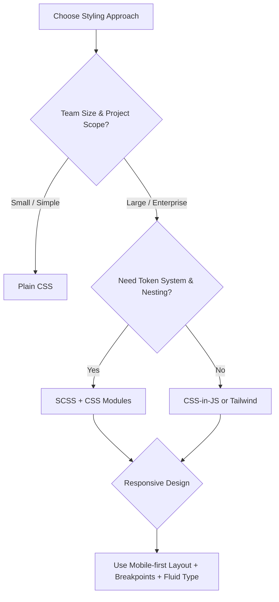

# Front-End Styling & Responsive Design Guide

This document provides a complete overview of **SCSS**, **CSS**, **Tailwind CSS**, and **Responsive Design strategies** for modern front-end projects.

---

## 1. SCSS (Sassy CSS)

SCSS is a superset of CSS that adds powerful features for maintainability and scalability.

### Benefits
- **Variables:** Centralized tokens for colors, spacing, breakpoints.
- **Nesting:** Contextual selectors, less repetition.
- **Mixins & Functions:** Reusable style blocks and logic.
- **Partials & Imports:** Modular file structure.
- **Inheritance (`@extend`):** Reuse common styles.
- **Compile-time checks:** Errors are caught before deployment.

### Example
```scss
$primary-color: #218838;

.button {
  background: $primary-color;
  padding: 0.5rem 1rem;

  &:hover {
    background: lighten($primary-color, 10%);
  }
}
```

---

## 2. Plain CSS

CSS is simple and widely supported but lacks advanced features like variables (except runtime custom properties) and nesting.

### When to Use
- Small projects or prototypes.
- When no build step is desired.
- When simplicity is more important than scalability.

### Limitations
- No functions, loops, or mixins.
- Harder to organize for large projects (requires naming conventions like BEM).

---

## 3. Tailwind CSS

Tailwind CSS is a **utility-first CSS framework** that lets you build UI directly in your markup.

### Benefits
- **Fast development:** Write styles directly in JSX/HTML.
- **Design tokens built-in:** Colors, spacing, typography scales are consistent.
- **Responsive utilities:** `sm:`, `md:`, `lg:` for breakpoints.
- **Tree-shaking:** Final CSS is very small.
- **No naming headaches:** No need for BEM or custom class names.

### Example
```jsx
<button className="bg-green-600 text-white px-4 py-2 rounded-lg hover:bg-green-700">
  Save
</button>
```

### When Tailwind Shines
- Prototyping and rapid iteration.
- Large teams needing consistent design tokens.
- Projects with dark mode or multiple themes.

---

## 4. Comparison Table

| Feature                     | SCSS                     | CSS             | Tailwind CSS |
|-----------------------------|------------------------|---------------|-------------|
| Variables / Tokens          | ✔ Compile-time         | Custom Props  | ✔ Built-in |
| Nesting                    | ✔                     | ❌            | N/A |
| Functions & Mixins          | ✔                     | ❌            | N/A |
| Modular Architecture        | ✔ Partials            | ❌            | Built-in utilities |
| Requires Build Step         | ✔                     | ❌            | ✔ |
| Ideal For                   | Large apps, design systems | Simple pages | Token-driven UI, fast dev |

---

## 5. Responsive Design

### Core Principles
- **Mobile-first CSS:** Start with smallest layout, use `min-width` media queries to enhance.
- **Content-driven breakpoints:** Add where layout breaks, not at arbitrary device sizes.
- **Fluid layouts:** Use %, flex, grid, `clamp()`.

### Layout Examples
```css
/* Grid that auto-fills columns */
.grid {
  display: grid;
  grid-template-columns: repeat(auto-fill, minmax(16rem, 1fr));
  gap: 1rem;
}

/* Flexbox wrapping */
.row {
  display: flex;
  gap: 1rem;
  flex-wrap: wrap;
}

/* Media query */
@media (min-width: 48rem) {
  .sidebar { display: block; }
}
```

### Fluid Typography
```css
h1 { font-size: clamp(1.5rem, 2vw, 2.5rem); }
```

### Responsive Images
```html

```

### Tailwind Example
```jsx
<div className="grid gap-4 grid-cols-1 sm:grid-cols-2 lg:grid-cols-4">
  {/* Responsive columns */}
</div>
```

---

## 6. Testing Responsive Design
- **Browser DevTools:** Simulate devices and breakpoints.
- **Playwright / Cypress:** Visual regression at key breakpoints.
- **Zoom & Accessibility Testing:** Ensure layouts work at 200% zoom and with long localized strings.

---

## 7. Decision Guide (Mermaid)



---

## 8. Best Practices
- Use **SCSS variables** or Tailwind tokens for consistent colors/spacing.
- Prefer **mobile-first** approach and `clamp()` for typography.
- Keep **CSS modular** (CSS Modules, BEM, or Tailwind utilities).
- Automate **visual regression tests** for key breakpoints.

