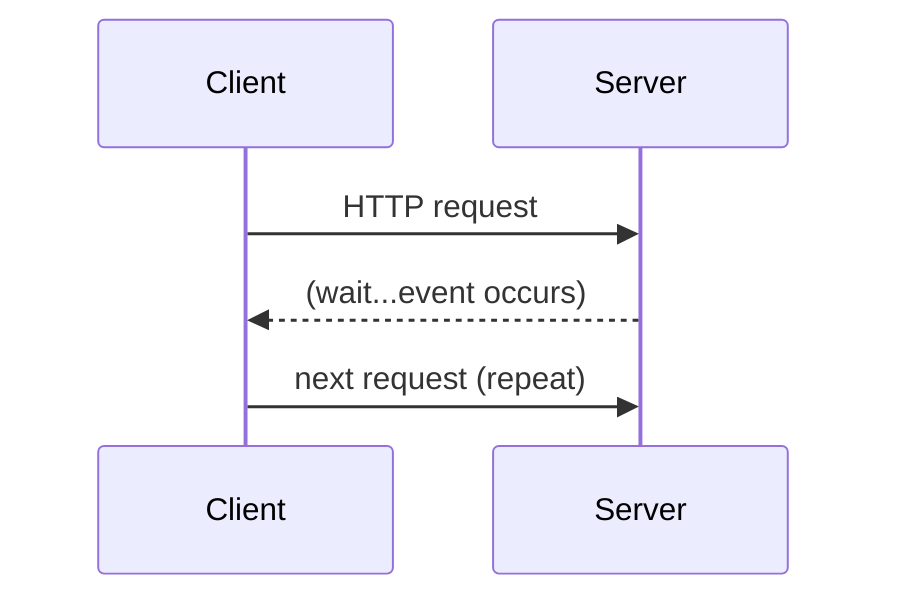
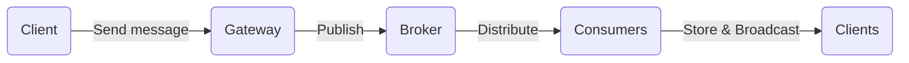
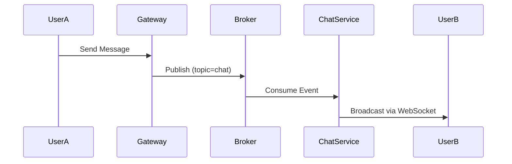

# 07 — Front-End System Design for Real-Time Applications (Part 1 of 3)
*(Sections 1–2 | Extended Bilingual Concepts Version)*

---

## 1. Fundamentals of Real-Time Communication

Real-time applications require **bi-directional, low-latency communication** between client and server.  
This is essential for chat apps, collaborative editors, stock dashboards, gaming, etc.

> 💡 **中文解释：** 实时应用要求客户端与服务器之间保持低延迟、双向通信。常见场景包括聊天、在线协作、金融行情与游戏。

### Key Design Goals

| Goal | Description |
|------|--------------|
| **Low Latency** | Deliver messages in milliseconds |
| **Scalability** | Support thousands/millions of connections |
| **Reliability** | Ensure message delivery & ordering |
| **Fault Tolerance** | Recover from connection or node failures |
| **Security** | Authenticate and encrypt every connection |

> 💡 **中文解释：** 实时系统的设计目标包括低延迟、高并发、可靠性、容错性与安全性。

### Common Real-Time Use Cases

- Chat & Messaging Systems  
- Collaborative Tools (Docs, Figma)  
- Live Dashboards (Analytics, Stock Prices)  
- Multiplayer Games  
- IoT Devices (Telemetry Streams)

---

## 2. Real-Time Communication Models

There are several major mechanisms for enabling real-time interaction on the web.

### 2.1 Long Polling

Long Polling is the simplest real-time mechanism using HTTP requests.

**How It Works:**
1. Client sends request to server.  
2. Server holds connection open until an event occurs.  
3. Server responds → client processes data.  
4. Client immediately re-requests to wait for next event.



> 💡 **中文解释：** 长轮询通过保持 HTTP 连接等待事件返回实现伪实时更新。虽然延迟较低，但服务器开销较大。

**Pros:**
- Works on any browser / server.  
- No special protocol needed.

**Cons:**
- High overhead due to frequent reconnections.  
- Not truly bidirectional.

---

### 2.2 WebSocket

**WebSocket** provides **full-duplex communication** over a single persistent TCP connection.

**Handshake Example:**
```http
GET /chat HTTP/1.1
Host: example.com
Upgrade: websocket
Connection: Upgrade
Sec-WebSocket-Key: x3JJHMbDL1EzLkh9GBhXDw==
Sec-WebSocket-Version: 13
```

**Server Response:**
```http
HTTP/1.1 101 Switching Protocols
Upgrade: websocket
Connection: Upgrade
Sec-WebSocket-Accept: HSmrc0sMlYUkAGmm5OPpG2HaGWk=
```

After handshake, both sides can send messages freely.

> 💡 **中文解释：** WebSocket 是真正的双向通信协议，客户端与服务器在握手后可相互发送数据，无需重新建立连接。

**Example (Browser Client):**
```js
const ws = new WebSocket("wss://chat.example.com");
ws.onopen = () => ws.send("Hello Server!");
ws.onmessage = (msg) => console.log("Received:", msg.data);
```

**Advantages:**
- Low latency.  
- Persistent connection.  
- Bidirectional data flow.  

**Disadvantages:**
- Requires WebSocket-compatible infrastructure.  
- Harder to scale horizontally (connection persistence).

---

### 2.3 Server-Sent Events (SSE)

SSE enables **unidirectional streaming** from server → client over HTTP.

**How It Works:**
- Client subscribes via `EventSource` API.  
- Server pushes text-based events continuously.

```js
const source = new EventSource("/events");
source.onmessage = (event) => console.log(event.data);
```

**Server Response Example:**
```http
HTTP/1.1 200 OK
Content-Type: text/event-stream

data: {"msg": "new update"}
data: {"msg": "another event"}
```

> 💡 **中文解释：** SSE 是基于 HTTP 的单向推送机制，适合持续广播更新（如新闻流、行情数据）。

| Comparison | WebSocket | SSE |
|-------------|------------|----|
| Direction | Bidirectional | Server → Client only |
| Transport | TCP (custom framing) | HTTP (text stream) |
| Use Case | Chat, multiplayer | Notifications, dashboards |
| Reconnect | Manual | Auto-reconnect built-in |

**Pros:**
- Simpler than WebSocket.  
- Auto-reconnect and event-based API.

**Cons:**
- One-way only.  
- Limited browser support for binary data.

---

### 2.4 WebRTC

**WebRTC (Web Real-Time Communication)** is a peer-to-peer communication protocol enabling **video, audio, and data channels** between browsers.

**Architecture Flow:**
```
Peer A ──(SDP Offer)──▶ Signaling Server ──(SDP Answer)──▶ Peer B
Peer A ◀── Media Stream (UDP via STUN/TURN) ──▶ Peer B
```

> 💡 **中文解释：** WebRTC 通过点对点连接实现音视频与数据传输。信令服务器仅负责交换连接信息（SDP）。

**Key Components:**
| Component | Function |
|------------|-----------|
| **STUN Server** | Finds public IP/port mapping |
| **TURN Server** | Relay when P2P fails |
| **Signaling Server** | Exchange metadata (SDP, ICE candidates) |

**Use Cases:**
- Video conferencing (Zoom, Meet).  
- Peer-to-peer file sharing.  
- Live streaming with minimal latency.

**Example (WebRTC DataChannel):**
```js
const pc = new RTCPeerConnection();
const channel = pc.createDataChannel("chat");
channel.onmessage = e => console.log(e.data);
channel.send("Hello Peer!");
```

> 💡 **中文解释：** WebRTC DataChannel 可实现无需中间服务器的点对点消息通信，常用于低延迟实时应用。

---

**End of Part 1 (Sections 1–2)**

# 07 — Front-End System Design for Real-Time Applications (Part 2 of 3)
*(Sections 3–4 | Extended Bilingual Concepts Version)*

---

## 3. Real-Time Architecture Design

Real-time architecture involves **continuous message exchange** between multiple components in a distributed system.

### 3.1 Typical Architecture Flow

```
Client ↔ Gateway (WebSocket / SSE)
       ↕
Message Broker (Redis PubSub / Kafka)
       ↕
Backend Consumers (Chat Service, Analytics, Notifications)
       ↕
Database (MongoDB, PostgreSQL)
```

> 💡 **中文解释：** 实时架构通常包括客户端、网关（如 Socket.io）、消息中间件（如 Kafka/Redis）以及多个消费服务，用于处理和分发事件。

### 3.2 Components Explained

| Component | Function | Examples |
|------------|-----------|----------|
| **Client** | Sends and receives messages | Browser / Mobile |
| **Gateway** | Manages WebSocket or SSE connections | Nginx, Socket.io, HAProxy |
| **Message Broker** | Buffers and routes messages | Redis Pub/Sub, Kafka, RabbitMQ |
| **Consumer Service** | Processes messages | Node.js workers, Go microservices |
| **Database** | Persists messages | PostgreSQL, DynamoDB |

### 3.3 Event-Driven Data Flow

1. User sends message via WebSocket.  
2. Gateway publishes it to broker (Redis/Kafka).  
3. Backend consumer receives event and stores it.  
4. Broker pushes event to all subscribed clients.  



> 💡 **中文解释：** 事件驱动模型通过消息队列解耦客户端与服务端，提高系统吞吐量与可靠性。

### 3.4 Advantages of Event-Driven Architecture
- Loose coupling between services  
- Easy scalability (add consumers)  
- Fault isolation  
- Asynchronous processing  

**Disadvantages:**
- Complex debugging  
- Event ordering & idempotency challenges  

> 💡 **中文解释：** 事件驱动架构可提升扩展性与容错性，但需妥善处理事件顺序与重复消费问题。

---

## 4. Scaling and Fault Tolerance in Real-Time Systems

Scaling real-time systems involves optimizing **connection handling, load distribution, and fault recovery**.

### 4.1 Scaling WebSocket Connections

| Strategy | Description | Tools |
|-----------|--------------|-------|
| **Sharding by User ID** | Divide clients into shards | Redis Cluster, NATS |
| **Sticky Sessions** | Same user always routed to same node | Nginx, HAProxy |
| **Connection Handoff** | Reassign live sessions between nodes | Custom via Socket.io adapter |

> 💡 **中文解释：** WebSocket 连接扩展通常通过分片、粘性会话或连接迁移实现。

**Example (Socket.io with Redis Adapter):**
```js
const { createAdapter } = require("@socket.io/redis-adapter");
const pubClient = createClient({ host: "redis", port: 6379 });
const subClient = pubClient.duplicate();
io.adapter(createAdapter(pubClient, subClient));
```

> 💡 **中文解释：** 通过 Redis Adapter，Socket.io 可以在多个节点间同步消息，实现水平扩展。

---

### 4.2 Handling Message Ordering and Consistency

**Techniques:**
1. Assign incremental message IDs.  
2. Use timestamp ordering or vector clocks.  
3. Implement idempotent message handlers.  

> 💡 **中文解释：** 为保证消息顺序与一致性，可使用自增 ID、时间戳排序与幂等消费逻辑。

**Example (Idempotent Handler):**
```js
const processed = new Set();
function handleMessage(msg) {
  if (processed.has(msg.id)) return;
  processed.add(msg.id);
  // process message safely
}
```

---

### 4.3 Fault Tolerance Strategies

| Layer | Strategy | Description |
|--------|-----------|-------------|
| **Client** | Retry & Backoff | Retry failed connections with delay |
| **Gateway** | Auto Reconnect | Use heartbeat and ping/pong |
| **Broker** | Replication | Use Kafka partition replication |
| **Service** | Circuit Breaker | Stop cascading failures |

> 💡 **中文解释：** 容错策略可从客户端到后端层层防御，通过重试、心跳检测、消息复制与熔断保护保障系统稳定性。

**Example Heartbeat Implementation:**
```js
setInterval(() => {
  ws.send(JSON.stringify({ type: "ping" }));
}, 30000);

ws.onmessage = (msg) => {
  if (msg.data === "pong") alive = true;
};
```

---

### 4.4 Rate Limiting & Backpressure Control

To prevent overload or abuse, apply rate limiting and backpressure techniques.

| Type | Description | Example |
|------|--------------|----------|
| **Token Bucket** | Allow N requests per time window | API Gateway |
| **Leaky Bucket** | Smooth traffic rate | Nginx / Envoy |
| **Backpressure** | Pause input until consumer ready | Stream APIs |

> 💡 **中文解释：** 限流（Token/Leaky Bucket）与反压机制可避免服务器过载，是高并发系统的关键控制点。

**Example (Express Middleware):**
```js
import rateLimit from "express-rate-limit";
const limiter = rateLimit({ windowMs: 1000, max: 10 });
app.use("/api/", limiter);
```

---

**End of Part 2 (Sections 3–4)**

# 07 — Front-End System Design for Real-Time Applications (Part 3 of 3)
*(Sections 5–6 | Extended Bilingual Concepts Version)*

---

## 5. Case Study — Designing a Scalable Real-Time Chat System

### 5.1 System Overview

A scalable chat system must handle millions of simultaneous connections while ensuring message delivery, ordering, and reliability.

**High-Level Architecture:**
```
Client (Web/Mobile)
   ↓ WebSocket
Gateway Layer (Socket.io / Nginx)
   ↓ Pub/Sub
Message Broker (Kafka / Redis Streams)
   ↓
Chat Service (Node.js / Go)
   ↓
Database (MongoDB / DynamoDB)
```

> 💡 **中文解释：** 聊天系统通常包含客户端、WebSocket 网关、消息中间件、后端服务和数据库。每层负责不同功能，从连接管理到消息持久化。

---

### 5.2 Message Flow

1. User sends a message via WebSocket.  
2. Gateway validates authentication and publishes to message broker.  
3. Chat service consumes message → saves to DB.  
4. Broker notifies other subscribed clients.  
5. Client updates UI in real time.



> 💡 **中文解释：** 通过消息中间件实现解耦，保证发送与接收逻辑独立，提高系统吞吐量与容错性。

---

### 5.3 Presence System (Online/Offline Status)

**Approach:**
- Track connection events (`onConnect`, `onDisconnect`).  
- Store presence data in Redis with TTL.  
- Broadcast state changes to subscribers.

```js
io.on("connection", socket => {
  redis.set(socket.userId, "online", "EX", 60);
  socket.on("disconnect", () => redis.del(socket.userId));
});
```

> 💡 **中文解释：** 在线状态通过 Redis 维护临时会话并广播变更，是实时系统常见子模块。

---

### 5.4 Typing Indicators & Read Receipts

| Feature | Mechanism | Example |
|----------|------------|----------|
| Typing Indicator | Ephemeral event | `socket.emit("typing", roomId)` |
| Read Receipt | Persisted flag | Update message status in DB |

> 💡 **中文解释：** Typing/已读状态是非持久事件，通常通过短期消息广播实现。

---

### 5.5 Scaling the Chat System

| Layer | Scaling Strategy |
|--------|------------------|
| **Gateway** | Redis adapter, load balancing |
| **Broker** | Kafka partitioning |
| **Chat Service** | Horizontal sharding by room/user |
| **Database** | Shard by userId, TTL indexes for ephemeral data |

> 💡 **中文解释：** 每一层均可水平扩展以支持数百万连接。关键在于分区策略与异步事件流设计。

---

## 6. Interview-Oriented Q&A Templates

### 6.1 “How would you design a real-time chat app like WhatsApp?”

**Answer Framework:**
1. Protocol: WebSocket for full-duplex.  
2. Delivery Guarantee: Kafka + idempotent consumers.  
3. Storage: MongoDB (messages), Redis (presence).  
4. Scale: Redis adapter + horizontal sharding.  
5. Monitoring: Prometheus + Grafana.

> 💡 **中文解释：** 回答时应明确协议选择、消息一致性策略、存储分层与监控体系。

**Bonus Tip:** Explain trade-offs (WebSocket vs SSE) and how you’d manage reconnects & delivery order.

---

### 6.2 “How do you guarantee message ordering in distributed systems?”

| Approach | Description |
|-----------|--------------|
| **Partition Ordering** | Kafka partitions preserve order per key |
| **Message ID Sequence** | Incremental IDs for sorting |
| **Timestamp Ordering** | Use event time |

> 💡 **中文解释：** 消息顺序可通过分区有序、消息 ID 或事件时间控制。面试中要强调幂等性处理。

---

### 6.3 “How to handle 1M concurrent WebSocket connections?”

| Layer | Solution |
|--------|-----------|
| **Infra** | Horizontal scaling, sharding connections |
| **Network** | Use HTTP/2 or QUIC |
| **Broker** | Redis Cluster / NATS |
| **Load Balancer** | Sticky sessions |
| **Monitoring** | Track connection health, ping/pong heartbeat |

> 💡 **中文解释：** 百万级连接的关键在于分片、连接保持和监控。答题时应从网络与应用层两方面说明。

---

### 6.4 “Compare WebSocket and SSE in real-time scenarios.”

| Feature | WebSocket | SSE |
|----------|------------|----|
| Direction | Bi-directional | Server → Client |
| Binary Support | Yes | No |
| Built-in Reconnect | Manual | Automatic |
| Complexity | Medium | Low |
| Use Case | Chat, Games | Notifications, Feeds |

> 💡 **中文解释：** SSE 更适合轻量级通知流；WebSocket 适合需要双向通信的实时场景。

---

### 6.5 “How to design failure recovery for real-time systems?”

**Strategies:**
1. Retry with exponential backoff.  
2. Heartbeat to detect dropped clients.  
3. Message persistence in broker.  
4. Graceful reconnect on resume.  

```js
function connect() {
  const ws = new WebSocket("wss://api.example.com");
  ws.onclose = () => setTimeout(connect, 2000);
}
connect();
```

> 💡 **中文解释：** 恢复机制包括重连、心跳检测与消息持久化，确保断线后数据不丢失。

---

## 7. Key Takeaways

1. Choose the right transport (WebSocket/SSE/WebRTC).  
2. Use brokers (Redis/Kafka) to decouple producers and consumers.  
3. Scale horizontally and maintain order via partitioning.  
4. Implement robust reconnect and monitoring.  
5. In interviews — reason about trade-offs, not technologies.

> 💡 **中文解释：** 实时系统的设计核心是低延迟、高可靠与可扩展性；面试中重点解释取舍逻辑。

---

**End of Part 3 (Sections 5–6 + Interview Q&A)**

