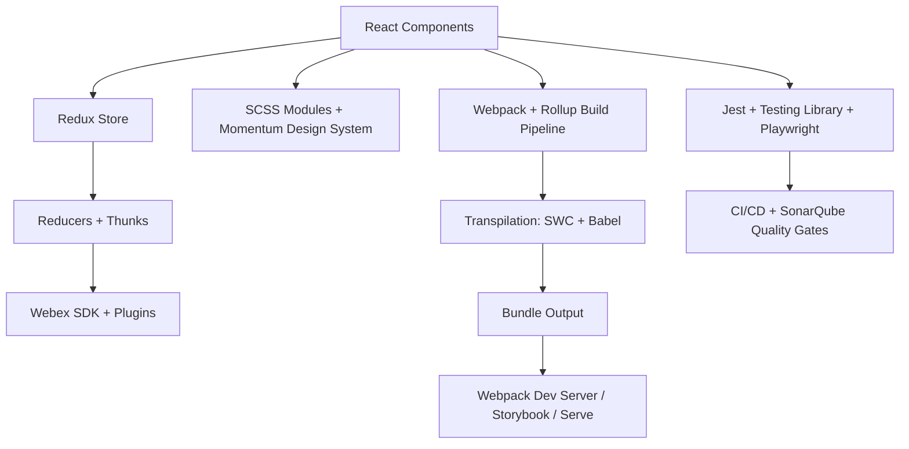

# Web Client – Tech Stack Overview

## 1. Core Framework & Language
- **React 16.14.0** – Primary UI library.
- **TypeScript 5.7.2** – Strict typing with strict build-time checking.
- **Redux (4.1.0) + Redux Thunk (2.3.0)** – State management and async handling.
- **Reselect (4.0.0)** – Memoized selectors for performance.

## 2. Build System & Tooling
- **Webpack 5.90.0** – Primary bundler (dev/prod configs, hot reload).
- **Rollup 4.24.0** – Preloader and specialized builds.
- **SWC + Babel** – Hybrid transpilation.
- **MiniCssExtractPlugin, css-loader, sass-loader** – SCSS compilation and bundling.
- **TerserWebpackPlugin** – JS minification.

## 3. Styling & UI
- **SCSS Modules** – Modular styles with Stylelint & BEM rules.
- **Momentum Design System** – `@momentum-design/components`, tokens, icons.
- **React Intl** – i18n & l10n support.
- **React Helmet** – Document head management.

## 4. Testing & QA
- **Jest 26.6.3** – Unit testing framework.
- **Testing Library (React, DOM, User-Event)** – Modern testing utilities.
- **Playwright 1.49.1** – E2E browser automation across Chrome, Edge, Firefox.
- **Axe-Core** – Accessibility testing.
- **lint-staged + Husky** – Pre-commit hooks.
- **ESLint + Prettier** – Code linting and formatting.
- **SonarQube** – Code quality gates.

## 5. Dev Server & Local Development
- **Webpack Dev Server** – Multiple modes: hot reload, HTTPS, integration.
- **Storybook 6.5.16** – Component development & documentation.
- **Serve** – Local production build preview.

## 6. Webex SDK & Plugins
- **@webex SDK modules** – Meetings, Conversation, Calling, Device, Encryption.
- **Internal Webex Plugins** – AI Assistant, LLM, Mercury, Voicea, etc.
- **Unified Scheduler MFE** – `@webexMFE/unified-web-scheduler-react`.

## 7. Utilities & Supporting Libraries
- **Immer** – Immutable state updates.
- **Day.js** – Lightweight date/time library.
- **UUID, Lodash, Classnames** – Utilities.
- **Quill + quill-mention** – Rich text editing.
- **Tippy.js** – Tooltips.
- **Three.js** – 3D graphics support.
- **Clipboard.js, file-saver** – Clipboard and file download helpers.
- **DomPurify** – HTML sanitization.

## 8. Package & Workspace Management
- **Yarn 3.6.4 (Berry)** – Package manager.
- **Workspaces** – Monorepo (`mcp/node`).

---

## High-Level Architecture Diagram

This stack represents a **large-scale, enterprise-ready React + TypeScript web client** with strong focus on **state management, build optimization, testing, and compliance (FedRAMP)**.
